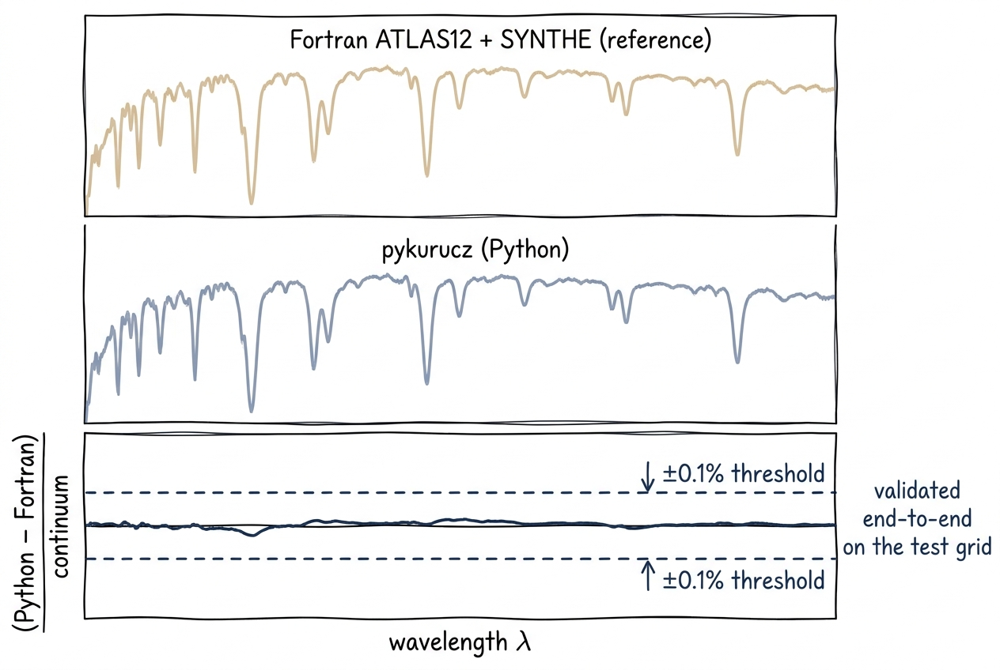

# Fortran Parity

<figure class="pk-figure" markdown="1">


<figcaption markdown="1">
The parity check at a glance: the Fortran ATLAS12 + SYNTHE reference (top) and pykurucz Python output (middle) are visually indistinguishable; the residual (bottom) stays inside the $\pm 0.1\%$-of-continuum band across the test grid.
</figcaption>
</figure>

pykurucz is a faithful, performance-tuned Python reimplementation, not a wrapper around Fortran. The hot loops are Numba-JIT'd and the algorithms have been streamlined where the Fortran chose convenience over speed, but every numerical step is traceable back to its Fortran ancestor. A central design goal is that the Python pipeline produces spectra that are indistinguishable from the original ATLAS12 + SYNTHE Fortran codes for all practical purposes.

## Validation Methodology

Validation is performed end-to-end:

1. **Generate an atmosphere** with Fortran ATLAS30 (or use a shared starting `.atm`).
2. **Synthesize a spectrum** with Fortran SYNTHE using the same line list and wavelength grid.
3. **Run the Python pipeline** on the identical inputs.
4. **Compare** the normalized flux \(F / F_{\rm cont}\) point-by-point.

Only wavelengths where the Fortran pipeline itself produces a valid reference spectrum are included in the comparison. Edge-of-grid cases where Fortran fails are treated as invalid references, not as Python failures.

### Validation results

Recent checks across a representative grid of stellar parameters show sub-0.1% flux differences:

| Model | \(T_{\rm eff}\) | \(\log g\) | Type | Median Δ | 95th pctl | 99th pctl |
|-------|-------|-------|------|----------|-----------|-----------|
| `t02500g-1.0` | 2500 K | −1.0 | Cool giant | 0.0006% | 0.023% | 0.065% |
| `t04000g5.00` | 4000 K | 5.0 | K dwarf | 0.00004% | 0.002% | 0.006% |
| `t08250g4.00` | 8250 K | 4.0 | A star | 0.0008% | 0.023% | 0.056% |
| `t10250g5.00` | 10250 K | 5.0 | Late B | 0.0008% | 0.020% | 0.047% |
| `t44000g4.50` | 44000 K | 4.5 | O star | 0.002% | 0.109% | 0.224% |

!!! fortran "Outlier threshold"
    The validation suite flags any wavelength where the normalized flux difference exceeds 0.10 (10%). In recent full-grid checks, no valid reference wavelength exceeded this threshold.

## How Parity Is Maintained

### Inline Fortran line references

Every major physics module contains comments that map Python functions and variables to their Fortran equivalents:

```python
# Fortran: DATA ATMASS, line 1652-1662 (atlas12.for)
mass = np.array([1.008, 4.003, ...])

# atlas12.for line 5247: IF(IFOP(14).EQ.1)CALL HLINOP
if ifop[13] == 1:
    ahline_all, shline_all = compute_hydrogen_wings(...)
```

This makes it possible to audit any numerical difference by comparing the Python code against the original Fortran source at the exact line numbers referenced.

### Exact loop logic

Control flow is replicated as faithfully as data flow. For example, the line-opacity accumulation kernel (`_accumulate_metal_profile_kernel` in `synthe_py/engine/opacity.py`) reproduces every Fortran label from the near-wing loop through the far-wing tail:

- Label 320: `N10DOP` computation
- Label 323: Early cutoff and boundary check
- Labels 324/326: Red and blue wing accumulation

!!! fortran "Why labels matter"
    Fortran SYNTHE uses `GO TO` extensively for performance. Replicating these control-flow paths in Python ensures that edge cases (e.g., a line whose opacity drops below `KAPMIN` exactly at `N10DOP`) are handled identically.

### Numba JIT for performance equivalence

The hot loops are JIT-compiled with Numba (`nopython=True`) so that their execution speed is comparable to compiled Fortran. This matters because:

- Algorithmic choices (e.g., early cutoff at `KAPMIN`) depend on fine-grained loop ordering.
- Vectorized NumPy operations can sometimes reorder floating-point operations differently than Fortran loops, introducing subtle differences.

By keeping the loop structure identical and compiling it with Numba, we preserve both the numerics and the performance.

### Identical interpolation and tables

All pre-tabulated physics data (partition functions, ionization potentials, opacity coefficients, damping constants) are extracted directly from the original Fortran binary files and stored as `.npz` archives in `atlas_py/data/` and `synthe_py/data/`. This guarantees that both codes are looking up the *exact same numbers*.

## Testing Strategy

The validation suite is organized into three levels:

1. **Unit tests** — Individual physics kernels (Voigt profile, Saha equation, partition functions) are tested against analytic or high-precision references.
2. **Integration tests** — Full `atlas_py` and `synthe_py` runs on a small set of standard atmospheres (Sun, Arcturus, Vega) are compared against archived Fortran outputs.
3. **Grid validation** — The full parameter grid is run in batch, and statistical summaries (median Δ, percentiles) are computed automatically.

!!! tip "Running your own validation"
    If you have access to the Fortran pipeline, you can compare outputs using the provided script:

    ```bash
    python synthe_py/tools/compare_spectra.py \
        results/spec/model_300_1800.spec \
        reference/model.spec \
        --range 300 1800 --top 5
    ```

## Known Limitations

- **Very cool giants** (\(T_{\rm eff} \lesssim 2500\) K, \(\log g \lesssim -1\)) can be difficult for both Fortran and Python. If Fortran ATLAS30 itself fails to produce a clean reference, that case is excluded from parity checks.
- **H₂O handling**: The default Fortran reference skips H₂O lines due to out-of-range `NBUFF` values in the original `tfort.12`. pykurucz matches this by default (`--h2o` is off in `synthe_py.cli`), but users may explicitly enable H₂O for cool-star work.

## Next Steps

- Read about the [JOSH solver](../physics/radiative-transfer.md) to understand the radiative transfer implementation.
- Explore [Opacity](../physics/opacity.md) for the details of continuous and line opacity sources.
- See [Data Flows](data-flows.md) for how intermediate files are validated and cached.
