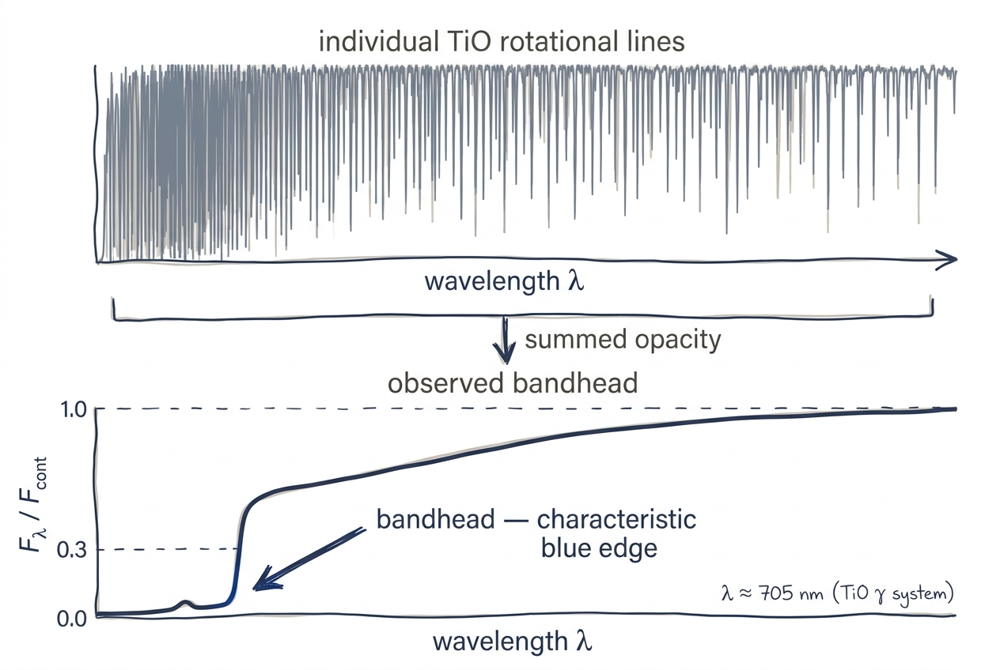

# Cool Star with Molecular Lines

<figure class="pk-figure" markdown="1">


<figcaption markdown="1">
Hundreds of individual rotational TiO transitions (top) pile up at the blue edge of a vibrational band to form the sharp absorption "bandhead" (bottom) that dominates cool-star spectra. This is why molecular line lists are not optional below $T_{\rm eff} \approx 4500$ K.
</figcaption>
</figure>

Cool stellar atmospheres ($T_{\rm eff} \lesssim 4500$ K) are dominated by molecular opacity. This tutorial shows how to synthesize spectra for an M dwarf and a K giant, emphasizing the strong molecular bands that shape their spectral energy distributions.

## What You Will Learn

- How to ensure molecular data (TiO, H$_2$O, CN, etc.) are downloaded and enabled
- How to select wavelength regions that capture key molecular features
- The difference between M-dwarf and K-giant spectra at similar temperatures

## Prerequisites

- pykurucz installed and data downloaded with the **full** dataset (not `--synthe-only`)
- Familiarity with the [Stellar Parameters](../user-guide/from-parameters.md) pipeline
- `numpy` and `matplotlib` for plotting

!!! warning "Molecular data is required"
    Cool-star synthesis without molecular lines is physically meaningless. The `--no-molecular-lines` flag (or `use_molecular_lines=False`) should never be used for $T_{\rm eff} < 4500$ K. pykurucz enables molecules by default when `data/molecules/` is populated.

## Step 1 — Verify Molecular Data

Before running, confirm that the molecular catalogs are present:

```bash
ls data/molecules/
```

You should see subdirectories such as `tio/`, `h2o/`, and Kurucz ASCII files for CN, CO, C$_2$, etc. If these are missing, rerun the downloader:

```bash
python scripts/download_data.py
```

!!! tip "Disk space"
    The full download is ~5.2 GB. The `--synthe-only` option omits the `gfpred29dec2014.bin` predicted-line binary needed by `atlas_py`; for Stellar Parameters you need the full dataset.

## Step 2 — Synthesize an M Dwarf

M dwarfs ($T_{\rm eff} \approx 3000$–$4000$ K) show some of the strongest molecular bands in stellar astrophysics. We choose $T_{\rm eff}=3500$ K, $\log g=5.0$ — typical of a mid-M dwarf.

=== "Python"

    ```python
    from pykurucz import synthesize

    spec_path = synthesize(
        teff=3500,          # Mid-M dwarf temperature
        logg=5.0,           # High gravity (main sequence)
        mh=0.0,             # Solar metallicity
        am=0.0,
        vturb=2.0,
        wl_start=500.0,     # Optical red — TiO bandhead region
        wl_end=750.0,       # Extends into TiO γ and ε systems
        resolution=300_000,
        output_dir="results_cool",
        use_molecular_lines=True,  # Default, but explicit is clearer
        include_tio=True,
        include_h2o=True,
    )
    ```

=== "CLI"

    ```bash
    python pykurucz.py \
        --teff 3500 --logg 5.0 \
        --wl-start 500 --wl-end 750 \
        --output-dir results_cool
    ```

!!! note "Runtime estimate"
    Cool stars have enormously more active lines than solar-type stars because of the dense molecular bands. The 250 nm window above at $R=300\,000$ takes approximately **10–20 minutes** on 8 cores. The `atlas_py` stage may also require a few extra iterations because the temperature structure is strongly affected by TiO opacity.

## Step 3 — Synthesize a K Giant

K giants ($T_{\rm eff} \approx 4000$ K, $\log g \approx 1.5$) have lower densities and therefore weaker collisional broadening, but their extended atmospheres produce deep molecular bands. We synthesize the same wavelength region for direct comparison.

=== "Python"

    ```python
    from pykurucz import synthesize

    spec_path = synthesize(
        teff=4000,          # K giant temperature
        logg=1.5,           # Low surface gravity (evolved star)
        mh=0.0,
        am=0.0,
        vturb=2.0,
        wl_start=500.0,
        wl_end=750.0,
        resolution=300_000,
        output_dir="results_giant",
    )
    ```

=== "CLI"

    ```bash
    python pykurucz.py \
        --teff 4000 --logg 1.5 \
        --wl-start 500 --wl-end 750 \
        --output-dir results_giant
    ```

## Step 4 — Compare the Spectra

The two synthetic spectra reveal dramatically different molecular signatures despite the relatively small temperature difference.

### Key features to look for (500–750 nm)

| Feature | Wavelength | Molecule | M dwarf ($3500/5.0$) | K giant ($4000/1.5$) |
|---|---|---|---|---|
| TiO $\gamma$ bandhead | ~495 nm (extends to 500+) | TiO | Extremely deep | Strong |
| TiO $\varepsilon$ | 584–629 nm | TiO | Saturated bands | Prominent |
| TiO $\delta$ | 705–730 nm | TiO | Deep | Moderate |
| VO bands | ~570, 620, 680 nm | VO | Visible in late M | Weak or absent |
| CaH | ~638, 675 nm | CaH | Moderate | Weak |

!!! physics "Why TiO dominates"
    Titanium is an iron-peak element with high solar abundance, and oxygen is the most abundant metal. In cool atmospheres TiO forms efficiently and has strong electronic transitions in the optical. The bandheads arise from closely spaced rotational lines that pile up at the band edge, producing nearly zero flux in late-type M dwarfs. See [Molecular Equilibrium](../physics/molecular-equilibrium.md) for the chemistry details.

### Plotting comparison

```python
import numpy as np
import matplotlib.pyplot as plt

# Load both spectra
wl_md, fl_md, ct_md = np.loadtxt(
    "results_cool/spec/t03500g5.00_mh+0.00_am+0.00_500_750.spec",
    unpack=True
)
wl_kg, fl_kg, ct_kg = np.loadtxt(
    "results_giant/spec/t04000g1.50_mh+0.00_am+0.00_500_750.spec",
    unpack=True
)

fig, ax = plt.subplots(figsize=(12, 5))

ax.plot(wl_md, fl_md / ct_md, lw=0.4, c="C0", alpha=0.9, label="M dwarf (3500/5.0)")
ax.plot(wl_kg, fl_kg / ct_kg, lw=0.4, c="C1", alpha=0.9, label="K giant (4000/1.5)")

ax.set_xlabel("Wavelength (nm)")
ax.set_ylabel(r"$F_\lambda / F_{\rm cont}$")
ax.set_ylim(0, 1.1)
ax.set_xlim(500, 750)
ax.legend(loc="lower left")
ax.set_title("Cool-Star Molecular Spectra Comparison")

# Annotate TiO bandheads
for wl0, label in [(516, "TiO γ"), (584, "TiO ε"), (705, "TiO δ")]:
    ax.axvline(wl0, color="gray", ls=":", lw=0.8, alpha=0.5)
    ax.text(wl0 + 2, 0.95, label, fontsize=8)

plt.tight_layout()
plt.savefig("cool_star_comparison.png", dpi=250)
```

You will see:

- The **M dwarf** spectrum is almost completely blanketed by TiO bands, with the continuum barely visible between bandheads. The normalized flux drops to near-zero across broad wavelength intervals.
- The **K giant** spectrum shows the same TiO bands but with more continuum peeking through, and overall deeper atomic lines relative to the molecular absorption because of the lower surface gravity (weaker pressure broadening).

## Step 5 — Near-Infrared H$_2$O (Optional)

If you extend the synthesis into the J-band, H$_2$O becomes the dominant opacity source for very cool stars. This is more relevant for late-M and L-type objects.

```python
from pykurucz import synthesize

spec_path = synthesize(
    teff=3500,
    logg=5.0,
    wl_start=900.0,   # Start of J-band
    wl_end=1400.0,    # J + H band
    resolution=100_000,  # Lower R saves time over such a wide range
    output_dir="results_cool_nir",
)
```

The output should show broad, shallow H$_2$O absorption troughs rather than the sharp TiO bandheads seen in the optical. At $T_{\rm eff}=3500$ K the H$_2$O features are present but not yet as overwhelming as in late-M dwarfs.

## Troubleshooting

| Symptom | Likely Cause | Fix |
|---|---|---|
| Spectrum looks like a smooth continuum (no lines) | Molecular data missing | Run `python scripts/download_data.py` |
| Na D lines too shallow (~10% depth) | `MOLECULES OFF` in atmosphere | Ensure `atlas_py` ran with `--enable-molecules` (default in Stellar Parameters) |
| Runtime much longer than estimate | Too many cores / memory contention | Limit workers with `n_workers=4` |

## Next Steps

- Explore [custom abundances](custom-abundances.md) to model carbon-star or metal-poor cool giants.
- Read about [opacity](../physics/opacity.md) and [molecular equilibrium](../physics/molecular-equilibrium.md) to understand the physics behind the band formation.
- See the [Resolution Comparison](resolution-comparison.md) to learn whether you need $R=300\,000$ or can use a lower value for broad-band work.
