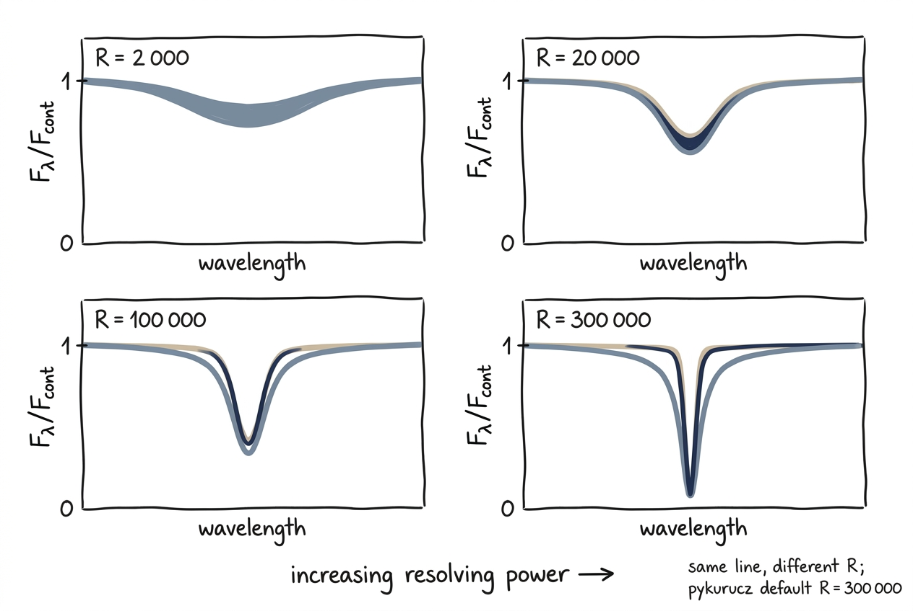

# High vs. Low Resolution

<figure class="pk-figure" markdown="1">


<figcaption markdown="1">
The same absorption line at four resolving powers. At $R = 2{,}000$ it is barely a saucer; by $R = 300{,}000$ (pykurucz's default) the sharp Voigt core and extended wings are fully resolved. Match $R$ to your instrument to keep your synthesis honest.
</figcaption>
</figure>

The choice of spectral resolution is one of the most important trade-offs in spectrum synthesis. High resolution reveals the full line profile shape and resolves blended multiplets; low resolution runs faster and is often sufficient for broad-band photometric or survey comparisons. This tutorial shows how to generate and compare spectra at three characteristic resolutions.

## What You Will Learn

- How the `resolution=` parameter controls the wavelength sampling
- The runtime trade-off between $R=300\,000$, $50\,000$, and $1\,000$
- When to synthesize at native resolution and when to convolve a high-$R$ grid
- How to overplot spectra for visual comparison

## Prerequisites

- Familiarity with the [Stellar Parameters](../user-guide/from-parameters.md) pipeline
- `numpy`, `scipy`, and `matplotlib` installed

## The Resolutions We Will Compare

| Resolution | Context | Typical Use Case |
|---|---|---|
| $R=300\,000$ | Echelle spectrograph (e.g., HARPS, ESPRESSO) | Detailed line-profile analysis, bisector studies |
| $R=50\,000$ | High-resolution spectrograph (e.g., X-Shooter, MIKE) | Chemical abundance work, RV monitoring |
| $R=1\,000$ | Survey photometry / low-res spectrograph (e.g., LAMOST, Gaia RVS) | Stellar parameter estimation, broad feature fitting |

!!! physics "Resolving power definition"
    pykurucz uses $R = \lambda / \Delta\lambda$ to set the uniform log-spacing of the wavelength grid. The number of points scales linearly with $R$ and with the logarithmic wavelength span. A full 300–1800 nm synthesis at $R=300\,000$ contains ~5.5 million pixels.

## Step 1 — Run Three Resolutions

We use the same stellar parameters and wavelength range so that any difference is purely due to sampling. We select a 50 nm chunk around the Mg b triplet and Na D lines — a region rich with narrow metal lines.

=== "Python script"

    ```python
    from pykurucz import synthesize
    from pathlib import Path

    teff, logg, mh, am = 5770, 4.44, 0.0, 0.0
    wl_start, wl_end = 515.0, 565.0  # Mg b + Na D region

    resolutions = [300_000, 50_000, 1_000]
    spec_paths = {}

    for R in resolutions:
        print(f"\n=== Synthesizing at R={R:,} ===")
        spec_path = synthesize(
            teff=teff,
            logg=logg,
            mh=mh,
            am=am,
            wl_start=wl_start,
            wl_end=wl_end,
            resolution=R,
            output_dir=f"results_res_{R}",
        )
        spec_paths[R] = spec_path
    ```

=== "CLI (sequential)"

    ```bash
    for R in 300000 50000 1000; do
        python pykurucz.py \
            --teff 5770 --logg 4.44 \
            --wl-start 515 --wl-end 565 \
            --resolution $R \
            --output-dir "results_res_${R}"
    done
    ```

!!! note "Runtime estimate"
    Runtimes on an 8-core workstation for the 50 nm window above:

    | Resolution | synthe_py time | Total time |
    |---|---|---|
    | $R=300\,000$ | ~2–4 min | ~5–8 min |
    | $R=50\,000$ | ~20–40 s | ~3–5 min |
    | $R=1\,000$ | < 5 s | ~2–4 min |

    The `atlas_py` atmosphere iteration dominates the total time only at very low resolution; at high $R$, synthesis is the bottleneck. For a full 300–1800 nm range, the ratio is even more extreme.

## Step 2 — Load and Compare

All three outputs cover the same wavelength window, but the pixel counts differ dramatically:

```python
import numpy as np

for R in [300_000, 50_000, 1_000]:
    wl, fl, ct = np.loadtxt(
        f"results_res_{R}/spec/t05770g4.44_mh+0.00_am+0.00_515_565.spec",
        unpack=True
    )
    print(f"R={R:>7,}: {len(wl):>7,} pixels,  spacing={np.mean(np.diff(wl))*1e3:.3f} pm")
```

The output should show something like:

```
R=300,000: 160,168 pixels,  spacing=0.312 pm
R= 50,000:  32,034 pixels,  spacing=1.561 pm
R=  1,000:     641 pixels,  spacing=78.023 pm
```

At $R=1\,000$, the Mg b triplet (spanning ~1.6 nm) is sampled with only ~20 pixels — enough to see the blended feature as a single broad depression, but not to resolve the three components.

## Step 3 — Plot the Comparison

The following script overplots the three resolutions and includes zoom panels for the Mg b and Na D regions.

```python
import numpy as np
import matplotlib.pyplot as plt

def load_spec(R):
    path = f"results_res_{R}/spec/t05770g4.44_mh+0.00_am+0.00_515_565.spec"
    wl, fl, ct = np.loadtxt(path, unpack=True)
    return wl, fl / ct

fig = plt.figure(figsize=(12, 9))
gs = fig.add_gridspec(3, 1, height_ratios=[1, 1, 1])

# --- Full range ---
ax0 = fig.add_subplot(gs[0])
colors = {300_000: "C0", 50_000: "C1", 1_000: "C2"}
labels = {300_000: r"$R=300\,000$", 50_000: r"$R=50\,000$", 1_000: r"$R=1\,000$"}

for R in [300_000, 50_000, 1_000]:
    wl, norm = load_spec(R)
    ax0.plot(wl, norm, lw=0.5 if R >= 50_000 else 1.5,
             c=colors[R], alpha=0.9, label=labels[R])

ax0.set_ylabel(r"$F_\lambda / F_{\rm cont}$")
ax0.set_ylim(0, 1.1)
ax0.set_xlim(515, 565)
ax0.legend(loc="lower left")
ax0.set_title("Resolution Comparison: Solar Spectrum (515–565 nm)")

# --- Mg b zoom ---
ax1 = fig.add_subplot(gs[1])
for R in [300_000, 50_000, 1_000]:
    wl, norm = load_spec(R)
    mask = (wl >= 516.0) & (wl <= 519.0)
    ax1.plot(wl[mask], norm[mask], lw=0.5 if R >= 50_000 else 1.5,
             c=colors[R], alpha=0.9)

ax1.axvline(516.73, color="gray", ls="--", lw=0.5)
ax1.axvline(517.27, color="gray", ls="--", lw=0.5)
ax1.axvline(518.36, color="gray", ls="--", lw=0.5)
ax1.set_ylabel(r"$F_\lambda / F_{\rm cont}$")
ax1.set_ylim(0, 1.1)
ax1.set_xlim(516, 519)
ax1.set_title("Mg b Triplet Zoom")

# --- Na D zoom ---
ax2 = fig.add_subplot(gs[2])
for R in [300_000, 50_000, 1_000]:
    wl, norm = load_spec(R)
    mask = (wl >= 588.0) & (wl <= 590.5)
    ax2.plot(wl[mask], norm[mask], lw=0.5 if R >= 50_000 else 1.5,
             c=colors[R], alpha=0.9)

ax2.axvline(588.99, color="gray", ls="--", lw=0.5)
ax2.axvline(589.59, color="gray", ls="--", lw=0.5)
ax2.set_xlabel("Wavelength (nm)")
ax2.set_ylabel(r"$F_\lambda / F_{\rm cont}$")
ax2.set_ylim(0, 1.1)
ax2.set_xlim(588, 590.5)
ax2.set_title("Na D Doublet Zoom")

plt.tight_layout()
plt.savefig("resolution_comparison.png", dpi=250)
```

You will see:

- **$R=300\,000$ (blue)**: Fully resolves the three Mg b components and the 0.6 nm split of the Na D doublet. Individual weak Fe I lines are visible everywhere.
- **$R=50\,000$ (orange)**: The Mg b triplet is marginally resolved, and the Na D lines are clearly separated but with slightly shallower cores. Weak lines begin to blend.
- **$R=1\,000$ (green)**: The entire 515–565 nm region looks like a smooth curve with a handful of broad depressions. Mg b and Na D are single unresolved features.

## Native Resolution vs. Convolution

A common question is whether to synthesize directly at low $R$ or to compute a high-$R$ spectrum and convolve it with a Gaussian kernel.

=== "Synthesize at target R"

    - **Faster**: Fewer wavelength points means less line-opacity accumulation.
    - **Self-consistent**: The radiative transfer is evaluated exactly on the output grid.
    - **Recommended when**: The target $R$ is the final science product and you do not need the high-$R$ grid for anything else.

=== "Synthesize at high R and convolve"

    - **More flexible**: One high-$R$ synthesis can be convolved to many different resolutions.
    - **Preserves information**: You retain the option to inspect line profiles later.
    - **Recommended when**: You are building a grid for multiple instruments or doing resolution-degradation studies.

!!! tip "How to convolve in Python"
    If you choose the high-$R$ + convolution route:

    ```python
    from scipy.ndimage import gaussian_filter1d
    import numpy as np

    # Load high-R spectrum
    wl, fl, ct = np.loadtxt("results_res_300000/spec/...spec", unpack=True)
    norm = fl / ct

    # Target R (e.g., 50,000)
    R_target = 50_000
    R_native = 300_000

    # Approximate Gaussian sigma in pixels
    # FWHM_ratio = R_native / R_target
    # sigma = FWHM_ratio / (2 * sqrt(2 * ln(2)))
    sigma_pix = (R_native / R_target) / 2.355
    norm_conv = gaussian_filter1d(norm, sigma=sigma_pix)
    ```

    The convolution is only approximate because the line-spread function (LSF) of real spectrographs is rarely a pure Gaussian. For rigorous instrument modeling, use the spectrograph’s published LSF or a sampled kernel.

## When to Use Which Resolution

| Science Goal | Recommended $R$ | Reason |
|---|---|---|
| Chemical abundance from EW | $50\,000$–$100\,000$ | Lines are resolved but file size is manageable |
| Line bisector / profile shape | $300\,000$ | Needs full core-to-wing sampling |
| Stellar parameters from broad features | $1\,000$–$10\,000$ | Fast; broad bands insensitive to $R$ |
| Grid generation for ML training | $50\,000$ | Good compromise of detail and speed |
| Cross-correlation RV | $300\,000$ | Maximum information content |

!!! warning "Do not oversample"
    Synthesizing at $R=300\,000$ when you only need $R=1\,000$ wastes CPU time and disk space. The line opacity accumulation scales roughly linearly with the number of wavelength points.

## Next Steps

- Apply these resolution choices to the [Solar Spectrum](solar-spectrum.md) example to see how Balmer lines change with $R$.
- Explore the [Cool Star](cool-star.md) example — molecular bandheads are much less sensitive to resolution than atomic lines.
- Read the [Output Files](../user-guide/output-files.md) guide for tips on handling large `.spec` files efficiently.
