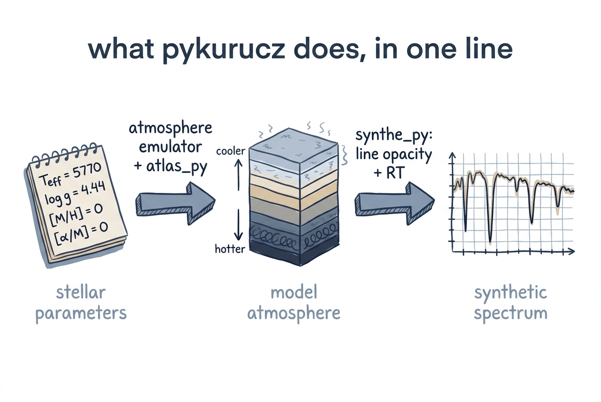
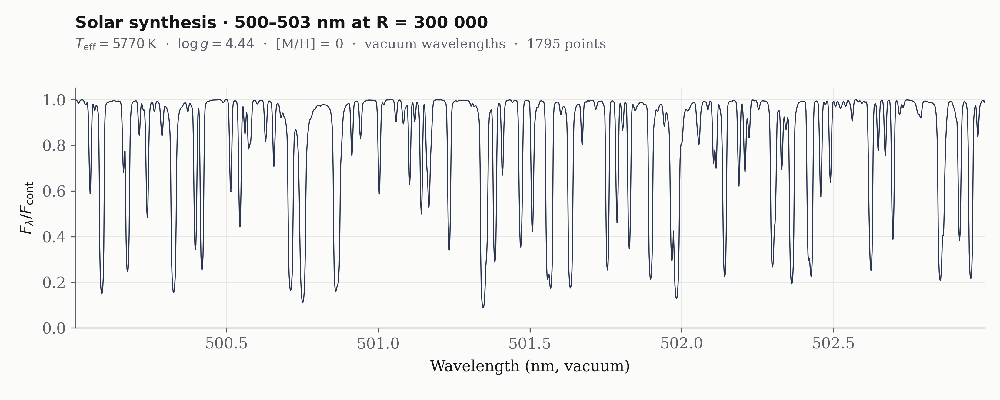

# Your First Spectrum

<figure class="pk-figure" markdown="1">


<figcaption markdown="1">
Four numbers in, one synthetic spectrum out. The atmosphere emulator + `atlas_py` build a self-consistent model atmosphere from your stellar parameters; `synthe_py` then folds line opacity and radiative transfer through that atmosphere to produce the emergent flux.
</figcaption>
</figure>

This page is a detailed walkthrough of your first end-to-end synthetic spectrum. We will generate the spectrum of a Sun-like star, inspect the intermediate outputs, and interpret the results.

## Roughly what to expect

The atmosphere emulator returns its warm start essentially instantly.
The `atlas_py` iteration is the slow part — most of the runtime is here,
scaling with the number of iterations to convergence and how aggressively
opacity is recomputed. The `synthe_py` synthesis cost is set by the
wavelength range and the number of lines that fall in it; it parallelises
across CPU cores by default. A 10-nm window finishes in a small fraction
of the time of a full 300–1800 nm synthesis.

Concrete timings depend on your hardware enough that you should benchmark
on your own machine rather than rely on a published number.

## Step 1 — Install and Download Data

If you haven't already, follow [Installation](installation.md) to set up the
Python environment and [Downloading Data](downloading-data.md) to fetch the
line-list binaries (~1.3 GB minimum).

## Step 2 — Run the Pipeline

We will synthesize a 10 nm chunk around 500 nm for the Sun:

```bash
python pykurucz.py --teff 5770 --logg 4.44 --wl-start 500 --wl-end 510
```

You should see three stages in the terminal:

1. **Emulator warm-start** — predicts the atmospheric structure
2. **atlas_py iteration** — self-consistently refines the atmosphere
3. **synthe_py synthesis** — computes the emergent spectrum

!!! note "Convergence"
    By default, `atlas_py` stops early if the physical columns change by less than `1e-3` after at least 5 iterations. For a solar model, this typically happens in 10–20 iterations.

## Step 3 — Inspect the Outputs

The pipeline writes four files under `results/`:

```
results/
├── atm/t05770g4.44_mh+0.00_am+0.00_warmstart.atm   # emulator prediction
├── atm/t05770g4.44_mh+0.00_am+0.00.atm             # iterated atmosphere
├── npz/t05770g4.44_mh+0.00_am+0.00.npz             # preprocessed cache
└── spec/t05770g4.44_mh+0.00_am+0.00_500_510.spec   # final spectrum
```

### The `.spec` file

<figure class="pk-figure" markdown="1">


<figcaption markdown="1">
Generated by this pipeline: normalised flux $F_\lambda / F_{\rm cont}$ for a Sun-like atmosphere ($T_{\rm eff} = 5770$ K, $\log g = 4.44$, [M/H] = 0) over a 3 nm chunk at the default $R = 300\,000$. Dozens of resolved Fe, Ti, Cr, Ni lines populate this dense optical region; their cores reach $\sim 10\%$ of the continuum and the Voigt wings are clearly visible.
</figcaption>
</figure>

The spectrum is a whitespace-delimited text file with three columns:

| Column | Name | Units | Description |
|---|---|---|---|
| 1 | Wavelength | nm (vacuum) | Wavelength of each sample point |
| 2 | \(F_\lambda\) | erg cm⁻² s⁻¹ nm⁻¹ | Total emergent flux (line + continuum) |
| 3 | \(F_{\rm cont}\) | erg cm⁻² s⁻¹ nm⁻¹ | Continuum-only flux |

The **normalized spectrum** is simply \(F_\lambda / F_{\rm cont}\). You can read and plot it in Python:

```python
import numpy as np
import matplotlib.pyplot as plt

wl, flux, cont = np.loadtxt(
    "results/spec/t05770g4.44_mh+0.00_am+0.00_500_510.spec",
    unpack=True
)

plt.figure(figsize=(10, 4))
plt.plot(wl, flux / cont, lw=0.5, c="C0")
plt.xlabel("Wavelength (nm)")
plt.ylabel(r"$F_\lambda / F_{\rm cont}$")
plt.title("Solar Spectrum (500–510 nm)")
plt.ylim(0, 1.1)
plt.tight_layout()
plt.savefig("solar_500_510.png", dpi=200)
```

!!! physics "Why vacuum wavelengths?"
    pykurucz uses vacuum wavelengths internally because the radiative transfer and line-opacity calculations are most naturally expressed in vacuum. The conversion to air is a simple multiplicative factor if you need to compare against observed spectra tabulated in air.

### The `.atm` file

The iterated atmosphere (`t05770g4.44_mh+0.00_am+0.00.atm`) is a Kurucz-format text file. It contains:

- Header cards: `TEFF`, `GRAVITY`, `TITLE`, `OPACITY`, `CONVECTION`, `ABUNDANCE`
- Abundance table for elements 1–99
- `READ DECK6` block with 80 layers of atmospheric structure

You can inspect it with any text editor, or load it programmatically:

```python
from atlas_py.io.atmosphere import load_atm

atm = load_atm("results/atm/t05770g4.44_mh+0.00_am+0.00.atm")
print(atm.temperature)   # shape (80,)
print(atm.gas_pressure)  # shape (80,)
```

### The `.npz` file

The `.npz` cache contains precomputed quantities that accelerate synthesis:

- Saha–Boltzmann populations for all ions
- Molecular equilibrium partial pressures
- Continuous opacity coefficients
- Doppler widths

It is generated by `convert_atm_to_npz.py` and consumed by `synthe_py.cli`. You generally do not need to interact with it directly, but you can load it with `numpy.load` if you wish to inspect the internal arrays.

## Step 4 — Experiment

Two axes to play with: the **stellar parameters** ($T_{\rm eff}$, $\log g$)
and the **abundance specification**. The atmosphere is rebuilt from
scratch each time, so changes to either propagate through to the
emergent spectrum self-consistently.

### Stellar parameters

```bash
# A cool K dwarf
python pykurucz.py --teff 4000 --logg 4.5 --wl-start 650 --wl-end 660

# A hot A star
python pykurucz.py --teff 8250 --logg 4.0 --wl-start 400 --wl-end 410
```

### Bulk abundance changes (`--mh`, `--am`)

```bash
# Metal-poor α-enhanced K giant — the standard halo / thick-disk knob set
python pykurucz.py --teff 4500 --logg 2.0 --mh -1.5 --am 0.3 \
    --wl-start 500 --wl-end 510
```

### Per-element abundance changes (`--abund`)

The whole point of driving ATLAS12 (rather than re-using a scaled-solar
atmosphere grid) is being able to do this and have the **atmosphere
respond** — not just the line strengths.

```bash
# CEMP-s star: Fe-poor, C and Ba enhanced
python pykurucz.py --teff 4800 --logg 1.5 \
    --abund Fe:-2.5 --abund C:+1.2 --abund Ba:+1.0 \
    --wl-start 400 --wl-end 700

# Same metal-poor giant as above but with carbon individually bumped
python pykurucz.py --teff 4500 --logg 2.0 --mh -1.5 --am 0.3 \
    --abund C:+0.6 \
    --wl-start 430 --wl-end 432   # zoom on the CH G-band
```

!!! tip "Start narrow"
    For quick experimentation, restrict the wavelength range to 10 nm.
    Full 300–1800 nm synthesis is much slower but covers the complete
    optical + NIR.

## Next Steps

- Read the [User Guide](../user-guide/overview.md) to understand Existing Atmosphere vs. Stellar Parameters in depth.
- Learn about [custom abundances](../examples/custom-abundances.md) and [resolution choices](../examples/resolution-comparison.md).
- Dive into the [Physics](../physics/opacity.md) reference for the details of opacity and radiative transfer.
