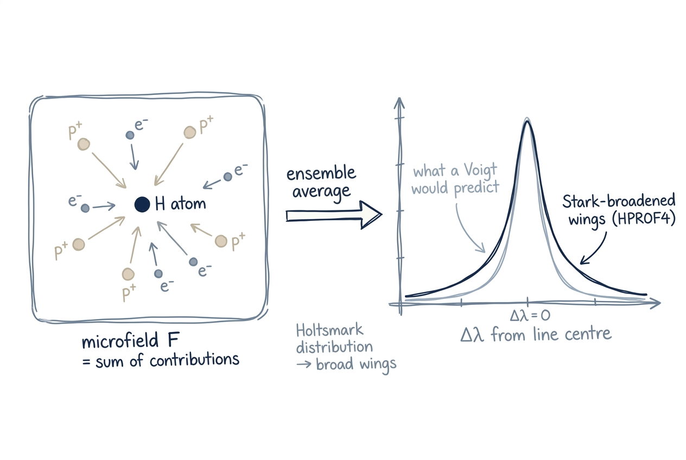

# Hydrogen & Helium

Hydrogen and helium dominate the mass and the opacity budget of almost
every stellar atmosphere. Their lines need special machinery: hydrogen
because the linear Stark effect makes its profiles fundamentally
non-Voigt, helium because its complex term structure forces the use of
tabulated profiles instead of first-principles calculations.

## Intuition

For most metal lines, the line shape is set by independent broadening
mechanisms (Doppler, natural, van der Waals, quadratic Stark) that
combine into a Voigt profile (see [line broadening](line-broadening.md)).

Hydrogen breaks that picture in two places:

1. The **linear Stark effect**. Because the unperturbed energy levels
   of hydrogen are degenerate in $\ell$, an electric microfield causes
   the levels to split linearly in field strength. The ensemble
   distribution of microfields produced by the surrounding plasma —
   the **Holtsmark distribution** — is much broader than a Lorentzian,
   and the ensemble-averaged line shape has long, slowly-falling wings
   that no Voigt fit can reproduce.
2. **Strong continuum coupling**. H⁻ is the dominant continuum opacity
   for solar-type stars in the optical, and any error in the
   neutral-H number density propagates straight into the predicted
   continuum level.

Helium is its own kind of mess: dozens of overlapping lines from
singlet and triplet systems, multiple metastable levels, and electron
collisions strong enough that the broadening cannot be computed from
first principles. The solution is to **tabulate** the line shapes from
quantum calculations and interpolate at synthesis time.

## Hydrogen lines

<figure class="pk-figure" markdown="1">

<figcaption markdown="1">
Neighbouring electrons and ions each contribute an electric field at the absorbing H atom; the ensemble of those microfields follows the Holtsmark distribution, much broader than a Lorentzian. The resulting line profile (right) has wings that no Voigt fit can reproduce — pykurucz uses HPROF4 tables instead.
</figcaption>
</figure>

### Stark broadening tables (HPROF4)

For each Balmer / Lyman / Paschen / etc. line, pykurucz reads the
**HPROF4** profile tables — the same precomputed Stark profiles used
by Fortran SYNTHE — and interpolates them in (electron density,
temperature, $\Delta\lambda$) space to produce the local line opacity
at every depth. The data carry the integrated Holtsmark microfield and
the hydrogenic wave-function overlap, so the resulting profile is
correct in the wings (where pure Voigt would be wrong) and in the core
(where the static-microfield approximation holds).

The function `compute_hydrogen_wings()` in
`synthe_py/physics/hydrogen_wings.py` interpolates the HPROF4 tables to
fill the synthesis-grid arrays `AHLINE` (absorption) and `SHLINE`
(source function) for every depth and every wavelength near a hydrogen
line.

### Hydrogen continuum

Hydrogen also dominates the continuum:

- **H⁻ bound–free** — peaks in the optical; provides about 80 % of
  $\kappa_{\rm cont}$ at 500 nm in the solar photosphere.
- **H⁻ free–free** — important in the IR, scaling with electron
  density.
- **H I bound–free** from $n=2, 3, …$ — Balmer / Paschen / Brackett
  edges. The Balmer edge sits near 364.6 nm (vacuum), the Paschen edge
  near 820.4 nm (vacuum). These thresholds are extremely sharp in the
  spectrum.
- **Thomson scattering** off the free electrons released by H
  ionisation, frequency-independent.

These are evaluated in the KAPP / COOLOP path alongside the metal and
helium continua (see [opacity](opacity.md)).

!!! physics "Why H⁻ dominates"
    The negative hydrogen ion has a weakly bound state (binding energy
    0.754 eV) and a large photoionisation cross-section that peaks in
    the optical. In the Sun, H⁻ provides ~80 % of the continuous
    opacity at 500 nm. Inaccurate H⁻ opacity throws off the predicted
    continuum level and therefore the depths of *all* the lines on top
    of it.

## Helium lines

### Tabulated profiles (`he1tables.dat`)

For He I, pykurucz loads tabulated line broadening profiles from
`lines/he1tables.dat` (and the corresponding pre-extracted
`synthe_py/data/he1_tables.npz`). The tables cover:

- He I lines broadened by electrons (Stark) and neutrals (van der
  Waals), with parameters drawn from Griem and from
  Dimitrijević–Konjević calculations.
- The strongest transitions in the visible / NIR; weaker He I lines
  fall back to the generic Voigt path.

The runtime helper `helium_profiles.py` interpolates these tables and
matches the Fortran `HE1LINE` subroutine bit-for-bit.

### Helium Voigt batch kernel

He I lines without explicit tabulated profiles fall back to the
standard Voigt with catalog damping constants. Because He I lines are
densely packed in the UV (every $n \to n'$ transition with all the
fine-structure components), pykurucz uses a dedicated Numba batch
kernel (`_compute_helium_voigt_batch`) to evaluate many of them in a
single pass.

## How abundance changes propagate

H and He are special: **He is fixed** at the constant
`HE_ABUNDANCE = 0.078370` (mass fraction) — it is *not* a user knob,
matching the standard ATLAS convention. **H is computed by mass
conservation**: `compute_h(mh, am, individual)` in `pykurucz.py` sets
$X_{\rm H} = 1 - X_{\rm He} - \sum_{Z \ge 3} 10^{A_Z}$. So when you
change `--mh`, `--am`, or any per-element `--abund`, $X_{\rm H}$
adjusts slightly to keep the total fraction unity. The shift is small
in the typical regime (metals are trace) but matters at very high
metallicity.

The **HPROF4** Stark tables for H lines and the **`he1tables.dat`**
profiles for He I lines are **abundance-independent** quantum-mechanical
tables — they capture how a hydrogen or helium atom responds to
electric microfields, not how many of them are present. The actual
**line widths used at synthesis time** still depend on abundance,
because they fold the table with the local electron density $N_e$
(set by Saha–Boltzmann ionisation, which depends on every donor in
the gas). So a metal-poor halo dwarf and a solar dwarf use the same
HPROF4 tables but produce noticeably different Balmer wings, because
the electron-donor budget is different.

The H⁻ and metal-photoionisation continuum pieces are abundance-driven
through the same Saha–Boltzmann path; see
[Opacity → How abundance changes propagate](opacity.md#how-abundance-changes-propagate).

## Why this matters

Skipping any of the hydrogen / helium machinery produces visible
errors:

| Skipped | Visible failure mode |
|---|---|
| HPROF4 hydrogen Stark tables | Balmer lines too narrow (no proper wings) in A and early-F stars |
| He I tabulated profiles | UV He I region wrong in B stars |
| H⁻ continuum | Continuum level off → all line depths off in solar-type stars |
| H I bound-free edges | Sharp continuum jumps at the Balmer/Paschen/Brackett edges missing |

## Implementation

| File | Role |
|---|---|
| `synthe_py/physics/hydrogen_wings.py` | HPROF4 interpolator (`compute_hydrogen_wings`) |
| `synthe_py/physics/helium_profiles.py` | He I tabulated-profile interpolator |
| `synthe_py/physics/voigt_jit.py` | `_compute_helium_voigt_batch` for He I lines without tables |
| `atlas_py/physics/kapcont.py` (and `synthe_py/engine/opacity.py`) | H⁻ b-f, H⁻ f-f, H I b-f, Thomson |

## Next Steps

- See [line broadening](line-broadening.md) for the generic Voigt
  machinery used by all non-H/He lines (and by He I lines without
  dedicated tables).
- See [opacity](opacity.md) for the full picture of how H/He continuum
  interleaves with metal and molecular lines.
- See [radiative transfer](radiative-transfer.md) to follow what
  happens once the opacity grid is built.
