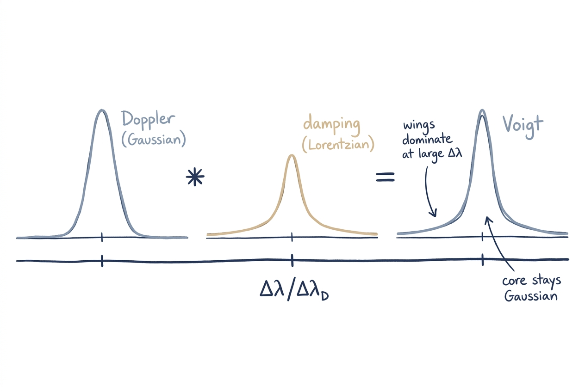

# Line Broadening

Spectral lines are never infinitely narrow. Three independent mechanisms
spread the absorption (and emission) over a finite wavelength interval:
the natural linewidth set by quantum lifetimes, Doppler broadening from
the thermal/turbulent motion of absorbers, and pressure broadening from
collisions. pykurucz combines them into a single **Voigt profile** for
every atomic and molecular transition.

## Intuition

Two qualitative shapes matter:

- **Doppler core**: a Gaussian, narrow and tall, set by the
  root-mean-square radial velocity of atoms in the gas (thermal +
  microturbulent).
- **Damping wings**: a Lorentzian, wide and shallow, set by the sum of
  natural, Stark, and van der Waals damping constants.

Because the two are independent, the actual line shape is the
**convolution** of a Gaussian and a Lorentzian — the Voigt function.
At low pressure the core dominates and the line looks Gaussian; at high
pressure the wings dominate and the line looks Lorentzian. Most metal
lines in solar-type stars sit in the regime where both contribute.

A useful single number is the dimensionless **damping parameter**

$$
a = \frac{\gamma}{4\pi\,\Delta\nu_D},
$$

the ratio of the Lorentzian half-width to the Gaussian Doppler width.
$a \ll 1$ means the line is essentially Gaussian; $a \sim 1$ means the
wings are visible; $a \gg 1$ rarely happens in stellar photospheres
except for the strongest resonance lines.

## Derivation

### Natural broadening

The radiative lifetime of an excited state sets a fundamental width via
the energy–time uncertainty relation:

$$
\gamma_{\rm rad} = \frac{4\pi e^2}{m_e c}\sum_j f_{ij}
\;=\; 0.2223 \times 10^8\,\text{s}^{-1} \times \sum_j f_{ij} .
$$

The GFALL catalog supplies $\gamma_{\rm rad}$ directly per transition
(in $\log_{10}$ form). It is usually the smallest of the three damping
contributions except for strong resonance and forbidden lines.

### Stark broadening

Charged-particle perturbations dominate for hydrogen (linear Stark) and
for any high-$n$ transition (quadratic Stark). For non-hydrogen lines,
GFALL supplies a coefficient that is multiplied by the local electron
density:

$$
\gamma_{\rm Stark} = \gamma_{\rm Stark}^{(\text{cat})} \times N_e .
$$

!!! physics "Hydrogen Stark broadening"
    Hydrogen Balmer and Lyman lines are *not* handled by the generic
    Voigt path — they need the dedicated **HPROF4** tables (see
    [Hydrogen & Helium](hydrogen-helium.md)). The Voigt code below is
    used for everything else.

### van der Waals broadening

Collisions with neutral hydrogen (and to a lesser extent He) are the
dominant pressure mechanism for most metal lines in cool and solar-type
stars:

$$
\gamma_{\rm vdW} = \gamma_{\rm vdW}^{(\text{cat})} \times N_{\rm H}
\times \left(\frac{T}{10^4\,\text{K}}\right)^{0.3} ,
$$

where $N_{\rm H}$ is the neutral hydrogen number density. The
temperature exponent 0.3 is the classical Unsöld approximation; a
fraction of GFALL lines carry more accurate exponents from quantum
calculations (encoded in the `LOG GAMMA` column of the catalog).

### Doppler width

The thermal velocity includes both thermal and microturbulent broadening:

$$
v_D = \sqrt{\frac{2 k_B T}{m_a} + v_{\rm turb}^2} ,
$$

where $m_a$ is the atomic mass of the absorber. The Doppler **width**
in wavelength is then $\Delta\lambda_D = \lambda_0 v_D / c$.

### Voigt profile

The Voigt function is the convolution of a Gaussian (Doppler) and a
Lorentzian (damping):

<figure class="pk-figure" markdown="1">

<figcaption markdown="1">
The narrow Gaussian (Doppler) core convolved with the slowly-decaying Lorentzian (damping) wings produces the Voigt profile on the right. The core stays Gaussian; the wings are dominated by the Lorentzian.
</figcaption>
</figure>

$$
H(a, x) = \frac{a}{\pi} \int_{-\infty}^{\infty} \frac{e^{-y^2}}{(x - y)^2 + a^2} \, dy ,
$$

with

- $x = \Delta\lambda / \Delta\lambda_D$ — displacement from line centre
  in Doppler units,
- $a$ — the damping parameter defined above.

Numerically the Voigt function is the real part of the Faddeeva
function, $H(a, x) = \mathrm{Re}\,w(x + ia)$, where $w(z)$ is computed
by `scipy.special.wofz`. This is the high-accuracy reference path.

### Why a fast lookup table for $a < 0.2$

The Faddeeva function is accurate everywhere but expensive — each call
costs hundreds of nanoseconds. In a synthesis loop we evaluate the
profile at ~20 points per line for ~1 million lines, so the cost adds
up.

For the **vast majority of metal lines in cool stars**, the damping
parameter satisfies $a < 0.2$. In that regime, the Voigt function can
be expanded as

$$
H(a, x) \;\approx\; H_0(x) + a\, H_1(x) + \mathcal{O}(a^2) ,
$$

i.e. a **linear interpolation** in $a$ between two pre-computed
profiles. pykurucz tabulates $H_0$ and $H_1$ on a fixed $x$-grid
matching Fortran SYNTHE, and at synthesis time looks them up in
$\mathcal{O}(1)$.

Why the cutoff at $a = 0.2$? At that value the
$\mathcal{O}(a^2)$ correction term contributes a few × 10⁻⁴ relative
error in the profile core — about the same level as the SYNTHE
opacity-cutoff threshold. Above $a = 0.2$ the linear expansion would
introduce visible deviations, so the code falls back to the full
Faddeeva path. The value is identical to the threshold used by the
Fortran code, ensuring numerical parity.

## Wing accumulation

Once the per-line profile shape is known, the opacity is added to the
synthesis wavelength grid. The accumulation strategy mirrors Fortran
SYNTHE labels 320–350:

1. **Near wing** — evaluate the profile at `N10DOP = int(10 * DOPPLE * RESOLU)`
   points centred on the line.
2. **Cutoff check** — once the local profile drops below `KAPMIN =
   CUTOFF * CONTINUUM`, stop the near-wing evaluation early.
3. **Far wing** — if the near wing finished before hitting cutoff,
   extrapolate as $X / n^2$ (Lorentzian asymptote) out to `MAXSTEP`
   points.
4. **Accumulate** — add red and blue wing contributions to the global
   opacity array; no per-step cutoff once we are past step 1.

## Implementation

| File | Role |
|---|---|
| `synthe_py/physics/voigt.py` | Reference Voigt evaluation via `scipy.special.wofz` |
| `synthe_py/physics/voigt_jit.py` | Numba-JIT'd lookup-table path (`H0TAB`, `H1TAB`) for $a < 0.2$ |
| `synthe_py/physics/lines.py` | Wing-accumulation loop driving the line opacity into the synthesis grid |

The lookup tables `H0TAB` and `H1TAB` are pre-computed on a 200-step
$x$-grid matching the Fortran spacing (so identical line wings are
produced as Fortran SYNTHE within floating-point accuracy). The JIT
kernel selects fast vs. slow path on a per-line basis.

!!! fortran "Why the constants `VSTEPS = 200`, `TABI = 1.5` look magic"
    These are the Fortran table resolution and lower-bound constants:
    200 grid points per Doppler width $\Delta\lambda_D$ across the
    table (more than enough to resolve the core shape with linear
    interpolation), and `TABI = 1.5` is the lower edge of the abscissa
    grid in Fortran (it indexes into a table whose first element starts
    at $x = -7.5$). They are reproduced bit-for-bit so that line wings
    match to floating-point precision.

## Next Steps

- See [hydrogen & helium](hydrogen-helium.md) for the dedicated
  Stark-broadened H profiles and tabulated He profiles that bypass this
  Voigt path.
- See [opacity](opacity.md) for how line and continuous opacities
  combine into $\kappa_{\rm tot}$.
- See [radiative transfer](radiative-transfer.md) to follow what JOSH
  does once the opacity grid is built.
