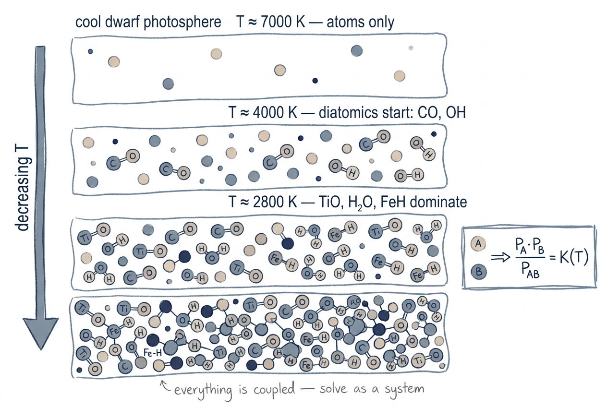

# Molecular Equilibrium

In cool stellar atmospheres ($T_{\rm eff} \lesssim 4500$ K), molecules
form in significant quantities and become dominant opacity sources.
Accurate spectrum synthesis therefore requires solving the **molecular
equilibrium**: the chemistry that determines the partial pressure of
every molecular species at every depth in the atmosphere.

## Intuition

<figure class="pk-figure" markdown="1">

<figcaption markdown="1">
As you move down (and cool down) through a cool-dwarf photosphere, atoms first pair into simple diatomics (CO, OH at $T \sim 4000$ K), then more complex molecules dominate (TiO, H₂O, FeH at $T \sim 2800$ K). Every species is coupled — solving one equilibrium constant in isolation gives the wrong answer.
</figcaption>
</figure>

In hot gas, almost everything is atomic — bonds break thermally as fast
as they form. As the gas cools, simple molecules (H₂, CO, OH, …) start
to "freeze out": their formation energy is below $k_B T$ and they remain
bound on average. By 3000–4000 K, oxides like TiO and VO can carry
several percent of the gas density and produce the characteristic broad
absorption bands of M dwarfs and red giants.

The key complication is that **everything is coupled**: the partial
pressure of TiO depends on how much atomic Ti is left, which depends on
how much Ti is locked up in O-bearing molecules, which depends on how
much O is left after CO formation, … Every species has to be solved
simultaneously, conserving the total elemental abundance.

This is what NMOLEC does.

## Derivation

### Equilibrium for a single diatomic

For a generic diatomic $AB$ with constituent atoms $A$ and $B$, the
law of mass action gives

$$
\frac{P_A \, P_B}{P_{AB}} \;=\; K_{AB}(T) ,
$$

where the equilibrium constant $K_{AB}(T)$ is set by the dissociation
energy $D_0$ and the rotational/vibrational/electronic partition
functions of the three species:

$$
K_{AB}(T) \;=\; \frac{Q_A Q_B}{Q_{AB}} \, (k_B T)^{5/2} \, \frac{(2\pi m_{AB})^{3/2}}{h^3} \, e^{-D_0 / k_B T} .
$$

In `data/lines/molecules.dat` the temperature dependence of each
$\log_{10} K(T)$ is stored as a polynomial (typically degree 4 in
$\log_{10} T$). NMOLEC evaluates the polynomial at every depth's local
$T$ to get $K(T)$ for each species.

### The coupled system

For a real photosphere we have $N$ atomic species and $M$ molecular
species. The unknowns are the partial pressures $\{P_A\}$ for the atoms
and $\{P_{AB}\}$ for the molecules. The equations are:

1. **Equilibrium**: one equation per molecule, relating its partial
   pressure to those of its constituents.
2. **Conservation**: one equation per element, requiring the *total*
   amount of element $X$ (free atoms + every molecule containing $X$,
   weighted by stoichiometry) to equal the prescribed elemental
   abundance.
3. **Charge neutrality / electron balance**, since some molecules ionise.

That gives $N + M$ algebraic equations in $N + M$ unknowns. The system
is **non-linear** because conservation couples atoms to every molecule
they appear in, and molecule equilibrium couples back to atomic partial
pressures.

### How NMOLEC iterates

NMOLEC solves the coupled system with a fixed-point iteration on the
**atomic partial pressures**:

1. Make an initial guess for $\{P_A\}$ (typically: ignore molecules and
   take the Saha–Boltzmann atomic pressures).
2. Use the current $\{P_A\}$ to compute every $P_{AB}$ via mass action.
3. For each element, sum up the partial pressures (free + molecular,
   with stoichiometry) and compare against the target abundance.
4. Adjust $\{P_A\}$ to reduce the residuals, and repeat from step 2.
5. Converge when every element's partial-pressure residual is below a
   tolerance, typically a few × 10⁻⁵ in relative terms.

The original Fortran NMOLEC uses a damped Newton-style update on
$\log P$; the Python translation reproduces the same step structure, so
the same number of iterations is needed for convergence.

## Species and data

`atlas_py` and `synthe_py` solve equilibrium for **~50 molecular
species**. The list in `synthe_py/physics/mol_populations.py` includes
every species needed for cool dwarfs through M giants:

- **Hydrides**: H₂, CH, NH, OH, MgH, AlH, SiH, CaH, ScH, TiH, VH, CrH, MnH, FeH, CoH, NiH, CuH, …
- **Oxides**: CO, NO, O₂, SiO, MgO, AlO, CaO, ScO, TiO, VO, CrO, MnO, FeO, YO, ZrO, LaO, …
- **Carbides / cyanides**: C₂, CN, C₃, HCN
- **Sulphides / halides**: SH, SO, FH, ClH, ClO, S₂, HeH, LiH, BeH, …
- **Triatomics**: H₂O, CO₂

In all there are about 50 species; the exact count depends on which
isotopologues are counted separately.

For each species, `molecules.dat` carries:

- the dissociation energy $D_0$ in eV,
- the polynomial coefficients of $\log_{10} K(T)$,
- isotope corrections where relevant.

### Cool-star spectral signatures

The dominant molecular bands you can expect to see in cool-star spectra
(approximate **bandhead** wavelengths, given as **vacuum** values
consistent with pykurucz's internal convention):

| Feature | Bandhead (nm) | Molecule | Stellar type |
|---|---|---|---|
| TiO γ system bandheads | ~516, 544, 586, 615, 705 | TiO | M dwarfs/giants |
| H₂O bands (NIR) | ~940, 1130, 1380 | H₂O | Late M, brown dwarfs |
| CN violet system | ~388, 421 | CN | Carbon stars, giants |
| CO first-overtone | ~2300 | CO | All cool stars |
| CH G-band | ~430.5 | CH | F–G dwarfs |
| MgH | ~478 | MgH | K giants |

These wavelengths refer to **bandheads** (the sharp blue edge of a
rotational-vibrational band envelope), not individual line centres.
For exact line positions, consult the line lists themselves.

!!! physics "Why NMOLEC matters for cool stars"
    In a 4000 K dwarf, TiO alone can account for more than 10 % of the
    total opacity in the optical. Neglecting molecular equilibrium
    produces spectra that are systematically too blue and too shallow
    in molecular bands. Early pykurucz cool-star validation found a
    ~90 % discrepancy in the Na D doublet that traced directly to
    missing molecular opacity; switching `MOLECULES ON` resolved it.

## Implementation

| File | Role |
|---|---|
| `atlas_py/physics/nmolec.py` | NMOLEC solver invoked inside the atlas iteration |
| `atlas_py/io/molecules.py` | Parser for `molecules.new` / `molecules.dat` |
| `synthe_py/physics/mol_populations.py` | Standalone molecular-equilibrium solver used by `convert_atm_to_npz` |

### How abundance changes propagate

NMOLEC's elemental conservation constraint reads the same per-element
abundance vector that the rest of the code uses
(`_build_xabund_from_atm` in `synthe_py/physics/mol_populations.py`,
or the `xabund` argument inside `atlas_py/physics/nmolec.py`). When you
change `--mh`, `--am`, or any individual `--abund Z:offset`, the new
abundance vector is what NMOLEC conserves against — so the partial
pressures of every species are recomputed for the actual pattern, and
TiO / H₂O / CO / etc. are not borrowed from a scaled-solar template.
This matters in particular for CEMP-style cases where C/O > 1 flips
the carbon-bearing chemistry on its head: the same code path handles
it correctly with no special casing because the abundance vector is
the only input that changed.

Where it runs in the pipeline:

- In **Stellar Parameters**, NMOLEC is invoked from inside POPSALL on
  every `atlas_py` iteration; molecular populations are written into
  the converged `.atm` and reused by synthesis.
- In **Existing Atmosphere**, NMOLEC is invoked once by
  `convert_atm_to_npz.py` and the populations are stored in the `.npz`
  cache; synthesis never re-solves the chemistry inside the wavelength
  loop.

## Next Steps

- See [opacity](opacity.md) for how molecular populations turn into line
  opacity in the synthesis grid.
- See [line broadening](line-broadening.md) for the Voigt profiles
  applied to every molecular line.
- See the [atlas_py architecture](../architecture/atlas-py.md) for how
  NMOLEC plugs into the atmosphere iteration.
