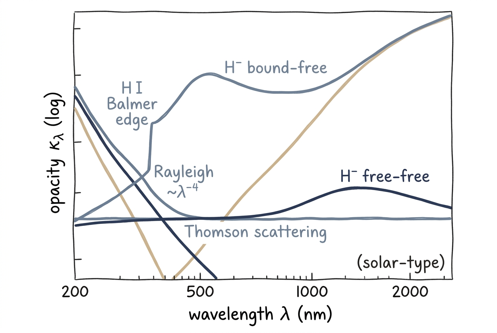

# Opacity

Opacity tells you how strongly the gas absorbs or scatters light at a
given wavelength. It is the single quantity that links the atmosphere
($T$, $P$, abundances) to the spectrum, and it is the most expensive
piece of the synthesis to compute correctly. pykurucz follows the
Fortran convention of splitting it into **continuous opacity** (a smooth
background from atomic ionisation, scattering, and molecular continua)
and **line opacity** (the discrete absorption profiles of $\sim$1.3
million atomic transitions plus several million molecular ones).

## Intuition

Continuous opacity sets the **floor** of the spectrum — the level at
which you would see flux if there were no spectral lines. It is a
broad, mostly-monotonic function of wavelength that depends on the local
temperature and ionisation balance.

Line opacity adds the **dips** on top of that floor: every absorbing
transition steals photons over a narrow wavelength interval set by its
broadening profile. The line depth at a given wavelength depends on the
ratio of line opacity to continuous opacity at that wavelength, which is
why "the same line" looks different in a hot star versus a cool star —
the continuous opacity background is different.

In the optical and near-infrared spectrum of a Sun-like star, **H⁻
bound-free** dominates the continuum (about 80 % of $\kappa_{\rm cont}$
at 500 nm in the photosphere), and **metal lines** dominate the line
opacity. Both numbers shift dramatically as you move to hot stars
(Thomson scattering takes over) or cool stars (molecular bands swamp
the metal lines).

## Continuous Opacity Sources

<figure class="pk-figure" markdown="1">

<figcaption markdown="1">
Schematic continuum opacity (log scale) vs. wavelength for a Sun-like photosphere. H⁻ bound-free dominates the optical, Rayleigh scattering rises blueward as $\lambda^{-4}$, the Balmer edge punches the H I bound-free step at ~365 nm (vacuum), Thomson scattering is flat, and H⁻ free-free contributes broadly in the infrared. Real opacity is a sum of these (and many more).
</figcaption>
</figure>

`atlas_py` and `synthe_py` evaluate the continuum via the **KAPP**
subroutine (and its cool-star extension **COOLOP**). The contributing
processes are:

### H⁻ bound-free and free-free

The negative hydrogen ion has a weakly bound state (binding energy 0.754 eV)
and a large photoionisation cross-section that peaks in the optical. In
solar-type stars it provides roughly 80 % of the continuous opacity at
500 nm. Bound-free cross-sections are interpolated from Mihalas-style
pre-tabulated tables; free-free is computed from the Saha-populated H⁻
number density.

### H I bound-free

Photoionisation from hydrogen excited states ($n=2, 3, \ldots$) is the
dominant continuum source in the near UV, especially the Balmer
($n=2 \to$ continuum, $\lambda < 364.6$ nm) and Paschen edges. pykurucz
follows the Karzas–Latter formulation with Gaunt factors lifted directly
from the Fortran tables.

### Helium

He I and He II photoionisation edges sit at their respective threshold
wavelengths. He II becomes important in hot stars
($T_{\rm eff} \gtrsim 20{,}000$ K) and Wolf–Rayet-like atmospheres.

### Metal photoionisation

Photoionisation from low-lying excited states of Fe I, Mg I, Si I, and
many other metals contributes a continuous "blanket" through the UV and
blue. Cross-sections are interpolated from `lines/continua.dat`, which
collates the Fortran ATLAS bound-free tables.

### Rayleigh scattering

Elastic scattering by neutral H, He, and H₂ rises steeply as
$\lambda^{-4}$ and dominates the continuum blueward of $\sim$400 nm in
cool dwarfs.

### Thomson scattering

Frequency-independent electron scattering, dominant in hot ionised
atmospheres (O / early B stars).

### Cool-star molecular continuum (COOLOP)

For $T_{\rm eff} \lesssim 4500$ K, molecular dissociation/formation
produces additional continuous opacity:

- CH and OH collisional contributions
- H₂–H₂ and H₂–He collision-induced absorption (CIA)

These are switched on automatically when `MOLECULES ON` is set (the
default).

### Two opacity grids: atmosphere vs. synthesis

pykurucz uses **two different frequency grids** for opacity, matching
ATLAS12 and SYNTHE conventions:

| Grid | Size | Used by | Why this size |
|---|---|---|---|
| Atmosphere grid | ~3000 frequency points spanning 9.1 nm – 10 µm | `atlas_py` during convergence iteration | Coarse enough to be cheap to recompute every iteration; dense enough to integrate the radiative flux to good accuracy |
| Synthesis grid | $\lambda/\Delta\lambda$ at the requested `--resolution` (~45 000 points for 300–1800 nm at $R=300{,}000$) | `synthe_py` during line-by-line synthesis | Spectral output grid; resolves every line profile |

When you change `--wl-start`, `--wl-end`, or `--resolution`, only the
**synthesis grid** changes. The 3000-point atmosphere grid is fixed by
the underlying ATLAS tables and is independent of the user request.

## Line Opacity

### Atomic lines

The Kurucz GFALL catalog `lines/gfallvac.latest` contains approximately
**1.3 million atomic transitions**. For each line, pykurucz computes:

- **Line-centre opacity** — proportional to $f$-value $\times$
  lower-level population from Saha–Boltzmann.
- **Voigt profile** — convolution of the Doppler (Gaussian, thermal +
  microturbulent) and damping (Lorentzian, natural + Stark + van der
  Waals) components.
- **Wing accumulation** — opacity is added to the synthesis grid out to
  the far wings, truncated where it falls below `CUTOFF * CONTINUUM`.

See [line broadening](line-broadening.md) for the Voigt machinery.

### Molecular lines

Molecular opacity is on by default when `data/molecules/` is populated.
The supported sources are:

- **TiO** — Schwenke binary line list (`schwenke.bin`)
- **H₂O** — Partridge–Schwenke binary line list (`h2ofastfix.bin`)
- **Kurucz ASCII catalogues** — CH, OH, CO, CN, C₂, MgH, SiH, FeH, and
  about 50 species in total

Molecular lines use the same Voigt machinery as atoms; their populations
come from the molecular equilibrium solver (see
[Molecular Equilibrium](molecular-equilibrium.md)).

!!! tip "Turning off molecules"
    `--no-molecular-lines` disables every molecular contribution; use
    `--no-tio` or `--no-h2o` to drop one specific binary while keeping
    the ASCII catalogues.

## Opacity Cutoff

To stop every line from contributing to the entire spectrum, SYNTHE
truncates each profile where it would only matter at the
sub-millicontinuum level:

$$
\kappa_{\rm line}(\Delta\lambda) < \text{CUTOFF} \times \kappa_{\rm cont}(\lambda) .
$$

The default `CUTOFF = 1e-3` matches Fortran SYNTHE. Lowering it (e.g.
`--cutoff 1e-4`) includes more weak lines and far-wing opacity at
roughly linear cost in run time. Raising it speeds up synthesis at the
expense of fidelity in dense line forests.

## Implementation

| Subroutine | Where | Role |
|---|---|---|
| `KAPP` (`atlas_py/physics/kapp.py`, `synthe_py/engine/opacity.py`) | both | Continuous opacity (H⁻, H I, He, metal b-f, Rayleigh, Thomson) |
| `COOLOP` (`atlas_py/physics/coolop.py`) | atlas only | Cool-star molecular continuum + CIA |
| `LINES` / wing accumulation (`synthe_py/physics/lines.py`) | synthe only | Atomic and molecular line opacity into the synthesis grid |

The atmosphere code calls KAPP every iteration on the 3000-point grid.
The synthesis code calls KAPP once on the high-resolution synthesis
grid and then folds the line opacities on top.

## Next Steps

- Read [line broadening](line-broadening.md) for the Voigt-profile
  details that govern the per-line shape.
- Explore [molecular equilibrium](molecular-equilibrium.md) for how
  molecular populations feed the line-opacity machinery.
- See [hydrogen & helium](hydrogen-helium.md) for the special-case
  treatment of the most abundant elements.
