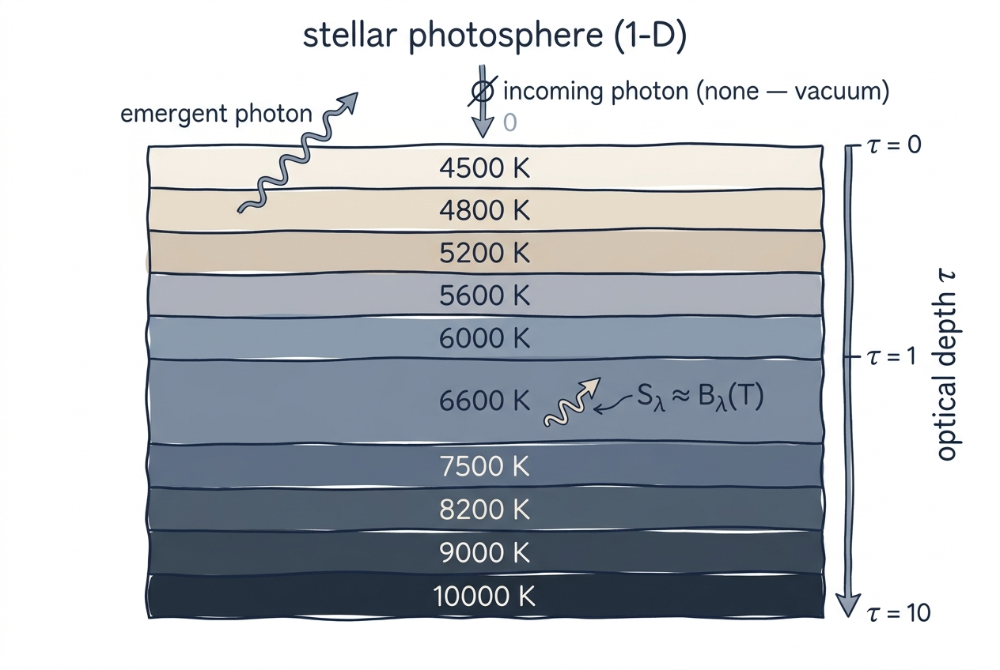

# Radiative Transfer

Radiative transfer (RT) is the bookkeeping that turns a stellar atmosphere
into a spectrum: how the light produced and absorbed at every depth
combines into the photons that finally escape from the surface. pykurucz
solves the 1-D plane-parallel transfer equation with a JOSH-style scheme,
the same algorithm used by Fortran SYNTHE, ported line-for-line into
`synthe_py/engine/radiative.py` and `atlas_py/physics/josh.py`.

This page builds the picture in three layers: the **intuition** for what
the equation means, the **derivation** of the discrete system pykurucz
actually solves, and the **implementation** in the Python source.

## Intuition

<figure class="pk-figure" markdown="1">

<figcaption markdown="1">
A 1-D plane-parallel photosphere as a stack of layers, each emitting roughly like a blackbody at its local temperature. Photons born deep travel up through the column, being absorbed and scattered along the way; what reaches $\tau = 0$ is the spectrum we observe.
</figcaption>
</figure>

Imagine a single column through the photosphere. At each depth the gas
emits some photons (thermal radiation) and absorbs/scatters some of the
photons that pass through (opacity). RT asks: given the temperature
structure $T(\tau)$ and the opacity sources, what is the **emergent
intensity** at the top of the atmosphere?

For a stationary 1-D atmosphere in LTE, the answer reduces to balancing
two competing processes at every layer:

- **Emission**: each parcel radiates roughly like a blackbody at its local
  temperature, $S_\lambda \approx B_\lambda(T)$.
- **Absorption**: photons travelling through the parcel are attenuated
  by $e^{-\Delta\tau}$ across an optical-depth element $\Delta\tau$.

The trick is that "the radiation field at depth $\tau$" depends on the
emission everywhere *else* in the column. So even though there is no
time-dependence, the equation is non-local — and that's what JOSH solves.

!!! physics "Plane-parallel approximation"
    The plane-parallel assumption is excellent for dwarfs and subgiants
    but breaks down for evolved giants with extended atmospheres
    ($\log g \lesssim 1$). pykurucz, like ATLAS12, is strictly 1-D.
    For spherical or 3-D geometries, ingest an external atmosphere via
    [Existing Atmosphere](../user-guide/from-atmosphere.md).

## Derivation

### The transfer equation

For specific intensity $I_\lambda(\tau, \mu)$ at angle $\mu = \cos\theta$
to the surface normal:

$$
\mu \frac{dI_\lambda}{d\tau_\lambda} = I_\lambda - S_\lambda
$$

where $\tau_\lambda$ is the monochromatic optical depth measured inward
and $S_\lambda$ is the source function. In **LTE** with no scattering,
$S_\lambda = B_\lambda(T)$.

The emergent flux is the angle-averaged outgoing intensity:

$$
F_\lambda = 2\pi \int_0^1 I_\lambda(0, \mu)\, \mu \, d\mu .
$$

### Moment form and the Eddington closure

Direct angle integration is expensive. JOSH instead solves the
**second-moment** form of the transfer equation. Define the moments of
the radiation field:

$$
J_\lambda = \tfrac{1}{2}\int_{-1}^{1} I_\lambda \, d\mu, \qquad
H_\lambda = \tfrac{1}{2}\int_{-1}^{1} I_\lambda\, \mu \, d\mu, \qquad
K_\lambda = \tfrac{1}{2}\int_{-1}^{1} I_\lambda\, \mu^2 \, d\mu .
$$

Taking $\int d\mu$ and $\int \mu\, d\mu$ of the transfer equation yields
the coupled pair

$$
\frac{dH_\lambda}{d\tau_\lambda} = J_\lambda - S_\lambda,
\qquad
\frac{dK_\lambda}{d\tau_\lambda} = H_\lambda .
$$

To close this system we need a relation between $K$ and $J$. Deep in the
atmosphere the radiation is nearly isotropic and $K \to J/3$; this
**Eddington closure** is exact in the diffusion limit. Combining the two
moment equations with $K = J/3$ gives a *single* second-order ODE for
$J$:

$$
\frac{1}{3}\frac{d^2 J_\lambda}{d\tau_\lambda^2} = J_\lambda - S_\lambda .
$$

That is what JOSH discretises and solves.

### Surface boundary condition: $J = \tfrac{3}{2}H$ at $\tau = 0$

At the top of the atmosphere there is no incoming radiation
($I_\lambda(\tau=0, \mu<0) = 0$). For a hemispherically isotropic outward
intensity ("two-stream" / Eddington at the boundary), the moments
satisfy

$$
J_\lambda(0) = \tfrac{3}{2}\, H_\lambda(0) ,
$$

which serves as the upper boundary condition on the second-order ODE.
At the bottom of the grid ($\tau \to \tau_{\max}$) the diffusion
approximation gives $H = (1/3) \, dB/d\tau$.

### Parabolic differencing → tridiagonal system

JOSH discretises $J(\tau)$ on the 80-layer atlas grid. Using a parabolic
fit through three consecutive depth points ($\tau_{i-1}, \tau_i,
\tau_{i+1}$) and substituting into the second-derivative term yields a
linear equation that **only couples three neighbouring layers**:

$$
a_i\, J_{i-1} + b_i\, J_i + c_i\, J_{i+1} = S_i .
$$

Stacking these for $i = 1, \dots, N_\tau$ (with the boundary conditions
above plugged into rows 1 and $N_\tau$) gives a **tridiagonal matrix**.
Tridiagonal systems are solved in $\mathcal{O}(N_\tau)$ by the **Thomas
algorithm** — a one-pass forward elimination followed by a back
substitution — much cheaper than the $\mathcal{O}(N_\tau^3)$ cost of a
generic Gaussian elimination.

Once $J$ is known, the flux follows from

$$
H_\lambda = -\frac{1}{3\,\kappa_\lambda} \frac{dJ_\lambda}{d\tau_\lambda} ,
$$

evaluated as a finite difference of $J$ on the depth grid.

### Scattering: $\Lambda$ iteration

When scattering matters (Thomson scattering in the UV, electron
scattering in hot stars), the source function depends on $J$ itself:

$$
S_\lambda = \frac{\kappa_{\rm abs}\, B_\lambda + \sigma_{\rm scat}\, J_\lambda}{\kappa_{\rm abs} + \sigma_{\rm scat}} .
$$

JOSH handles this with simple **$\Lambda$ iteration**:

1. Start with $S^{(0)} = B_\lambda$ (pure absorption).
2. Solve the tridiagonal for $J^{(n)}$.
3. Update $S^{(n+1)}$ using the formula above.
4. Stop when $|S^{(n+1)} - S^{(n)}|/S^{(n)} < \varepsilon$.

In `synthe_py`, the tolerance is set by `--scat-tol` (default `1e-3`)
and the maximum number of iterations by `--scat-iterations` (default 8).

!!! physics "$\Lambda$ iteration vs. ALI"
    Plain $\Lambda$ iteration converges slowly when scattering is optically
    thick, because each iteration only propagates information by one mean
    free path. **Accelerated $\Lambda$ Iteration (ALI)** or Ng acceleration
    would converge in many fewer iterations and could be added to a future
    version. For typical optical/NIR synthesis the 8-iteration default is
    fine; you only see the limitation in deep UV resonance lines.

## Implementation

The Python implementation lives in two places that share the same JOSH
core:

| File | Role |
|---|---|
| `synthe_py/engine/radiative.py` | Per-wavelength solver called by the synthesis loop |
| `atlas_py/physics/josh.py` | Identical algorithm called inside `atlas_py` iteration |

For each frequency point both files perform the same six steps, in
order:

1. **Build opacity / source vectors** from the atmosphere — `ACONT`,
   `ALINE`, `SIGMAC`, `SIGMAL`, `SLINE`, `SCONT` arrays at every depth.
2. **Total opacity** $\kappa_{\rm tot} = \kappa_{\rm cont} + \kappa_{\rm line} + \sigma_{\rm scat}$.
3. **Assemble the tridiagonal coefficients** $(a_i, b_i, c_i)$ from the
   parabolic differencing of the moment ODE.
4. **Thomas algorithm** to solve for $J$.
5. **Finite-difference $H$** from $J$ and the boundary conditions.
6. **Surface BC** $J = \tfrac{3}{2}H$ at $\tau = 0$ enforced exactly.

If scattering is enabled, steps 3–6 are wrapped in the $\Lambda$ loop.

!!! fortran "Fortran provenance & safety clamps"
    Each step of the Python implementation traces back to a labelled
    block in Fortran `JOSH`. The original Fortran clamps negative
    `HNU` values to a small positive floor; the Python translation
    reproduces this clamp exactly to avoid unphysical flux dips in
    strong scattering lines.

### Performance

JOSH is called once per wavelength point. For a full 300–1800 nm
synthesis at $R = 300{,}000$ this is $\sim$45 000 calls. Each call solves
an $N_\tau \times N_\tau$ tridiagonal ($N_\tau = 80$, so the solve
itself is cheap), but cumulative cost matters:

- **Numba JIT**: the inner solver is JIT-compiled, dropping per-call
  overhead to $\sim$10–100 µs.
- **Wavelength parallelism**: the 45 000 calls are independent and are
  distributed across CPU cores by the synthesis driver.

## Next Steps

- Learn about the [opacity sources](opacity.md) that fill the
  $\kappa_{\rm tot}$ vector.
- Read [line broadening](line-broadening.md) to see how individual lines
  contribute to $\kappa_\lambda$.
- See the [synthe_py architecture](../architecture/synthe-py.md) for how
  the JOSH solver is plugged into the parallel synthesis loop.
