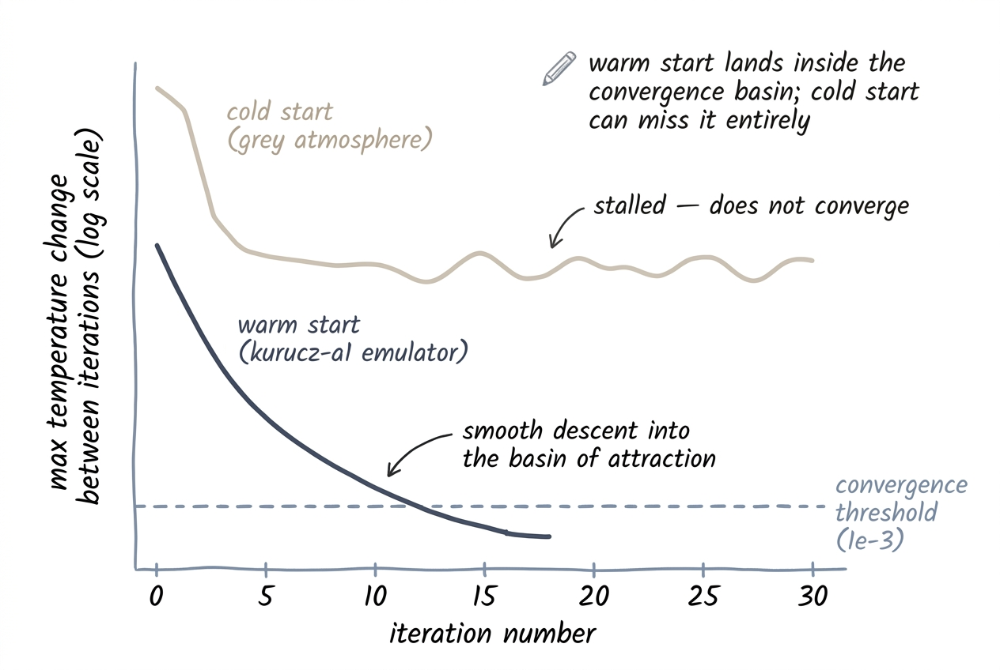

# The Atmosphere Emulator

The `kurucz-a1` emulator is a neural-network surrogate for ATLAS12 atmosphere generation. It predicts the full atmospheric structure — 80 depth points of temperature, pressure, density, and opacity — from just four stellar parameters. The point of the warm start is not just speed: it lands inside ATLAS's **convergence basin** so the iteration descends cleanly to the tolerance. A generic grey-atmosphere cold start, by contrast, can stall in a local minimum and fail to reach the threshold within the iteration budget — producing an atmosphere that is *not* converged even after 30 iterations.

## What the Emulator Does and Why

<figure class="pk-figure" markdown="1">


<figcaption markdown="1">
Why the warm start matters. Cold-starting from a generic grey atmosphere (top curve), the iteration drops for a few steps and then **stalls above the convergence threshold** — bouncing in a local minimum without ever crossing the dashed line. Warm-starting from the `kurucz-a1` emulator's prediction (bottom curve) lands inside the convergence basin, and ATLAS descends cleanly through the threshold in ~10–15 iterations.
</figcaption>
</figure>


In traditional ATLAS12, the first iteration starts from a grey-atmosphere approximation or a previously converged model. For arbitrary stellar parameters, this guess can be poor, requiring many iterations to converge. The emulator replaces this initial guess with a data-driven prediction trained on 104,269 converged ATLAS12 models. The result is:

- **Reliable convergence**: warm-starting lands inside ATLAS's convergence basin, so `atlas_py` reaches the tolerance in roughly 10–15 iterations. Cold starts can stall in a local minimum and never converge within the iteration budget.
- **Better stability**: the warm-start is physically plausible even at the edges of the training grid.
- **No Fortran dependency**: the emulator is a pure PyTorch module; no compiled Fortran code is needed.

!!! physics "Emulator vs. ATLAS12"
    The emulator predicts the converged atmospheric structure *as if* ATLAS12 had been run with the same scalar parameters. It captures the non-linear mapping from (\(T_{\rm eff}\), \(\log g\), [M/H], [α/M]) to the 80×6 output quantities, including the complicated feedback between temperature, opacity, and convection.

## Architecture

The network is a PyTorch MLP with separate encoders for global stellar parameters and per-depth optical depth:

<div class="pk-diagram">
<svg viewBox="0 0 920 200" xmlns="http://www.w3.org/2000/svg" role="img" aria-label="atmosphere emulator network architecture">
  <defs>
    <marker id="pk-arr-em" viewBox="0 0 10 10" refX="9" refY="5" markerWidth="7" markerHeight="7" orient="auto-start-reverse">
      <path d="M0 0 L10 5 L0 10 z" fill="var(--pk-muted)"/>
    </marker>
  </defs>
  <g font-family="Inter, sans-serif" font-size="13" fill="var(--pk-ink)">
    <rect x="20"  y="40" width="170" height="46" rx="8" fill="var(--pk-surface)" stroke="var(--pk-rule-strong)"/>
    <text x="34" y="60" font-weight="600">stellar params</text>
    <text x="34" y="76" font-size="10.5" fill="var(--pk-muted)">Teff · logg · [M/H] · [α/M]</text>

    <rect x="20"  y="120" width="170" height="46" rx="8" fill="var(--pk-surface)" stroke="var(--pk-rule-strong)"/>
    <text x="34" y="140" font-weight="600">τ grid</text>
    <text x="34" y="156" font-size="10.5" fill="var(--pk-muted)">80 optical-depth points</text>

    <rect x="220" y="40"  width="160" height="46" rx="8" fill="var(--pk-accent-soft)" stroke="var(--pk-accent-rule)"/>
    <text x="234" y="60" font-weight="600">stellar encoder</text>
    <text x="234" y="76" font-size="10.5" fill="var(--pk-muted)">4 → 512</text>

    <rect x="220" y="120" width="160" height="46" rx="8" fill="var(--pk-accent-soft)" stroke="var(--pk-accent-rule)"/>
    <text x="234" y="140" font-weight="600">τ-position encoder</text>
    <text x="234" y="156" font-size="10.5" fill="var(--pk-muted)">1 → 512</text>

    <rect x="410" y="80" width="120" height="46" rx="8" fill="var(--pk-bg-soft)" stroke="var(--pk-rule-strong)"/>
    <text x="424" y="100" font-weight="600">concatenate</text>
    <text x="424" y="116" font-size="10.5" fill="var(--pk-muted)">1024-dim</text>

    <rect x="560" y="80" width="170" height="46" rx="8" fill="var(--pk-accent-soft)" stroke="var(--pk-accent-rule)"/>
    <text x="574" y="100" font-weight="600">predictor MLP</text>
    <text x="574" y="116" font-size="10.5" fill="var(--pk-muted)">1024 → 2048 → 2048 → 6</text>

    <rect x="760" y="80" width="150" height="46" rx="8" fill="var(--pk-ink)"/>
    <text x="774" y="100" font-weight="600" fill="var(--pk-bg)">80 × 6 outputs</text>
    <text x="774" y="116" font-size="10.5" fill="var(--pk-bg)" opacity="0.75">RHOX,T,P,XNE,ABROSS,ACCRAD</text>
  </g>
  <g stroke="var(--pk-muted)" stroke-width="1.25" fill="none">
    <path d="M190 63 L216 63" marker-end="url(#pk-arr-em)"/>
    <path d="M190 143 L216 143" marker-end="url(#pk-arr-em)"/>
    <path d="M380 63 L398 63 L398 100 L406 100" marker-end="url(#pk-arr-em)"/>
    <path d="M380 143 L398 143 L398 106 L406 106" marker-end="url(#pk-arr-em)"/>
    <path d="M530 103 L556 103" marker-end="url(#pk-arr-em)"/>
    <path d="M730 103 L756 103" marker-end="url(#pk-arr-em)"/>
  </g>
</svg>
</div>

### Key details

| Component | Specification |
|---|---|
| Stellar encoder | 4 → 512 (LayerNorm + GELU) × 2 |
| Tau encoder | 1 → 256 → 512 (GELU) |
| Predictor | 1024 → 2048 → 2048 → 6 (GELU, 1% dropout) |
| Output | 80 depth points × 6 quantities |

The model is trained with min-max normalized inputs and log-scaled outputs (where physical quantities span many orders of magnitude). See [`emulator/normalization.py`](../architecture/emulator.md) for the exact transform.

## Training Range

The emulator was trained on a grid of 104,269 ATLAS12 models with the following bounds:

| Parameter | Minimum | Maximum |
|---|---|---|
| \(T_{\rm eff}\) | 2500 K | 50,000 K |
| \(\log g\) | −1.0 | 5.5 |
| [M/H] | −4.0 | +1.5 |
| [α/M] | −0.2 | +0.62 |

!!! warning "Do not extrapolate"
    Using the emulator outside this range is unsupported. The warm-start may be physically implausible, causing `atlas_py` to converge slowly or diverge. If your target lies outside these bounds, use [Existing Atmosphere](from-atmosphere.md) with an externally computed atmosphere.

## Using it from Python

### Loading the emulator

```python
from emulator import load_emulator

emulator = load_emulator()
```

This loads the bundled weights (`emulator/a_one_weights.pt`) and normalization parameters (`emulator/norm_params.pt`) onto CPU by default.

### Predicting atmospheric structure

```python
import numpy as np

# Predict the 6 physical quantities at 80 depth points
pred = emulator.predict(
    teff=5770,
    logg=4.44,
    feh=0.0,
    afe=0.0,
)

print(pred["T"])       # shape (80,) — temperature in K
print(pred["P"])       # shape (80,) — pressure in dyn cm⁻²
print(pred["RHOX"])    # shape (80,) — mass column density
```

### Generating a 9-column `.atm` array

For direct use in `pykurucz.py` internals, you can generate the full 9-column atmosphere array:

```python
data = emulator.predict_atmosphere_data(
    teff=5770, logg=4.44, feh=0.0, afe=0.0, vturb=2.0
)
print(data.shape)  # (80, 9)
```

The columns are: `RHOX`, `T`, `P`, `XNE`, `ABROSS`, `ACCRAD`, `VTURB`, `FLXCNV`, `VCONV`.

## Integration with `atlas_py`

In the standard Stellar Parameters pipeline, `pykurucz.py` calls `emulator_warmstart_atm(...)` to write the warm-start `.atm` file, then immediately invokes `atlas_py.cli` with `MOLECULES ON`. The emulator's prediction is treated exactly like a `READ DECK6` input in Fortran ATLAS12.

!!! fortran "Fortran parity"
    The emulator plays the same role as `READ DECK6` in the Fortran pipeline. Validation runs confirm that starting from the emulator prediction and iterating with `atlas_py` yields atmospheres that are numerically consistent with Fortran ATLAS12 references.

## Limitations

- **4-parameter space**: The emulator is trained on scalar [M/H] and [α/M]. Highly non-solar abundance patterns (e.g., extreme r-process or neutron-capture enhancements) are not represented in the training data. Use [Existing Atmosphere](from-atmosphere.md) for such cases.
- **1D plane-parallel geometry**: Like ATLAS12 itself, the emulator assumes a plane-parallel atmosphere. Extended giants with significant spherical extension may need 3D or spherical models.
- **LTE only**: The emulator does not account for NLTE effects. If you need NLTE atmosphere structures, use an external code.

## Next Steps

- Read the [Stellar Parameters](from-parameters.md) guide for the full end-to-end pipeline.
- Explore the [Architecture](../architecture/emulator.md) page for implementation details of the PyTorch model.
- Check the [CLI Reference](cli-reference.md) for flags that control convergence and output.
