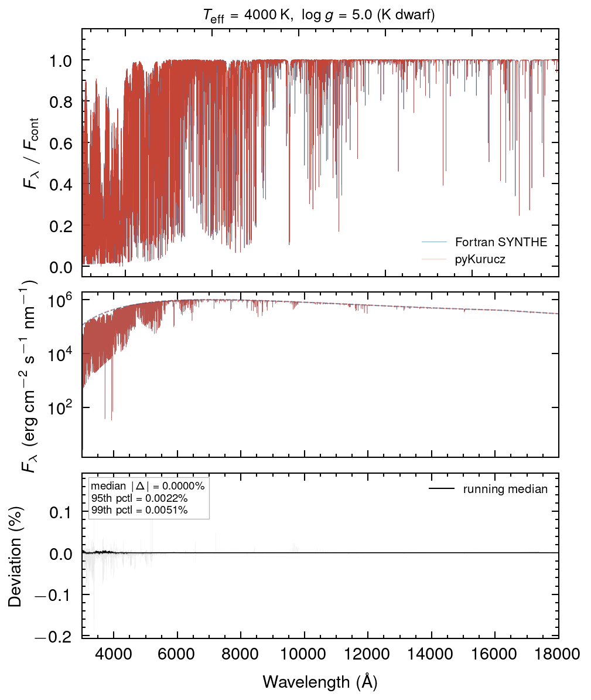
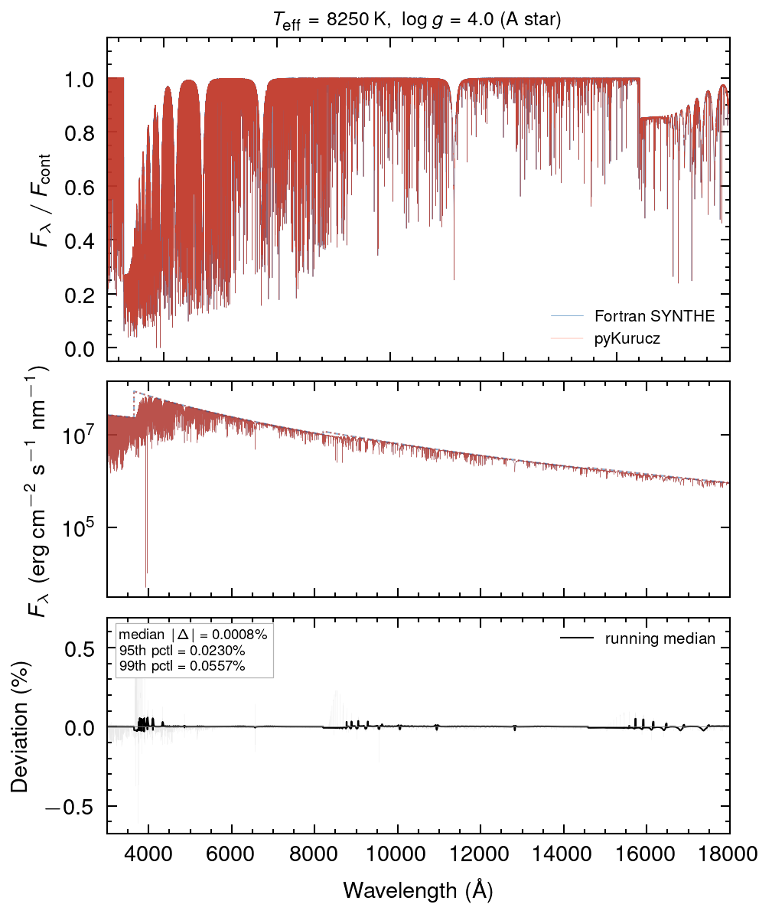
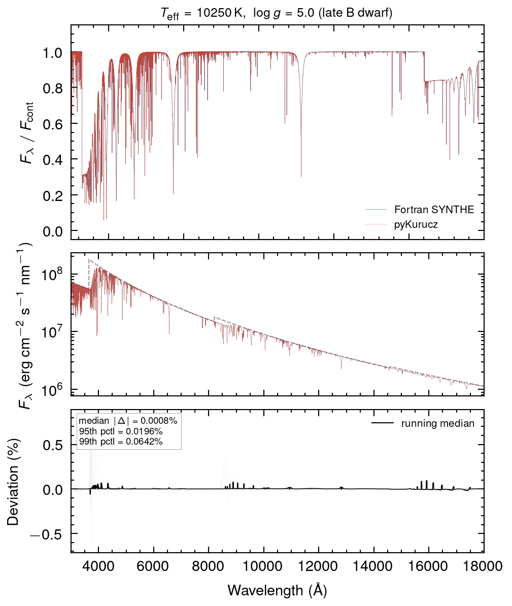
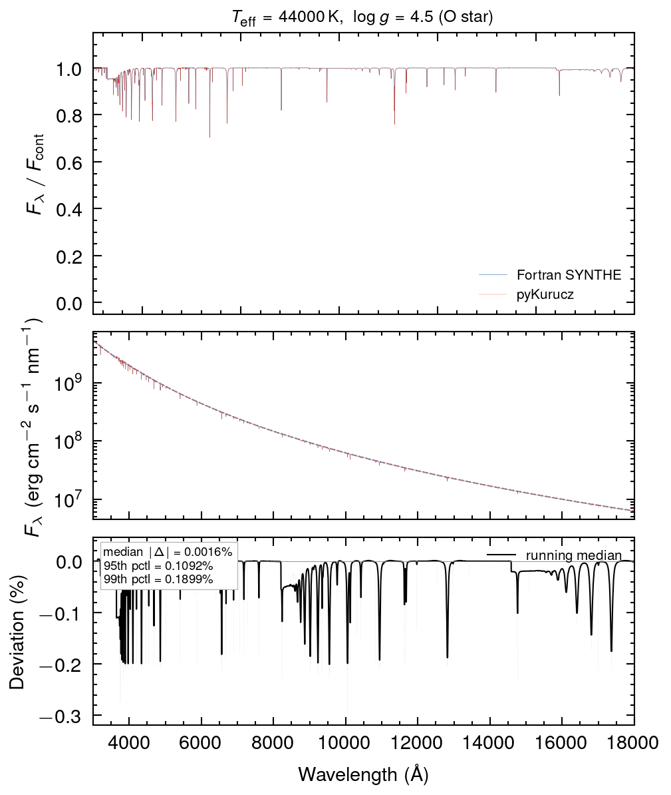

# Summary

pyKurucz is a pure Python reimplementation of Kurucz's SYNTHE spectrum synthesis code — the standard tool for computing synthetic stellar spectra from first principles. Stellar spectra encode information about a star's temperature, gravity, and chemical composition, but extracting it requires a forward model: given a stellar atmosphere and a catalog of atomic transitions, compute the light that escapes at each wavelength. SYNTHE has filled this role for decades. pyKurucz performs the same calculation, to the same numerical precision, entirely in Python.

The calculation proceeds wavelength by wavelength. At each point, the code evaluates how opaque the stellar atmosphere is. The *continuous* (smooth) opacity component arises from H$^-$ absorption (the dominant source in Sun-like stars), hydrogen bound-free (Karsas & Latter cross-sections for levels $n=1$–$15$, analytic for higher), helium, metals, Rayleigh scattering, and Thomson scattering — all interpolated from pre-tabulated arrays following the original KAPP logic. The *line* component comes from discrete atomic transitions: every line in the Kurucz GFALL catalog (~1.3 million entries) near the current wavelength contributes a Voigt profile combining thermal (Doppler) and pressure (van der Waals, Stark, radiative) broadening. Hydrogen Balmer and Lyman lines receive dedicated Stark-broadened profiles via the HPROF4 routine (Holtsmark ion microfield theory, Griem impact corrections, quasi-molecular H$_2$/H$_2^+$ satellites for Lyman-$\alpha$). Helium lines use tabulated BCS/Griem/Dimitrijević profiles.

Once opacity is known at every layer, the code solves the radiative transfer equation. The emergent Eddington flux $H_\nu$ is computed by the JOSH solver — a port of Kurucz's ATLAS routine — integrating on a fixed log-$\tau$ grid with parabolic optical depth quadrature, source function remapping, and Lambda iteration for scattering, yielding both line+continuum $F_\lambda$ and continuum-only $F_{\rm cont}$.

The relative populations of ionization and excitation states — determining how many absorbers are available for each transition — follow from Saha ionization equilibrium and Boltzmann excitation with detailed partition functions. Molecular equilibrium for ~300 diatomic species is solved during atmosphere preprocessing, affecting the electron donor budget and number densities.

The implementation uses NumPy, SciPy, and Numba (JIT compilation of inner loops), requiring no Fortran compiler. It is validated to sub-0.01% median agreement with the original Fortran across stellar types from 2500 K cool giants to 44000 K O stars over 300–1800 nm at resolving power $R = 300{,}000$.

# Statement of need

Kurucz's SYNTHE is the most widely used code for computing synthetic stellar spectra from first principles, with the atomic and molecular line lists that accompany it accumulating tens of thousands of citations over several decades [@kurucz2005]. The original Fortran, written in a pre-Fortran-77 dialect with fixed-format source, single-character variables, computed GOTOs, and EQUIVALENCE statements, is incompatible with modern `gfortran` without significant manual patching — compiling it is a rite of passage that has defeated many research groups. Following the passing of Robert L. Kurucz in 2025, the long-term maintenance trajectory of the original code is uncertain. This work provides a faithful, ground-truth numerical reimplementation of SYNTHE in pure Python — not a wrapper around Fortran, but a line-by-line translation validated against the original.

Spectrum synthesis requires a model atmosphere as input — a file describing the temperature–pressure–density stratification of the stellar photosphere. The `synthe_py` package works with any Kurucz-format `.atm` file from any source (ATLAS12, MARCS, PHOENIX, etc.). For convenience, the repository also bundles a pre-trained neural network emulator [kurucz-a1; @li2025] that can predict ATLAS12-quality atmospheric structures from four stellar parameters, but this is an optional component — the synthesis engine itself has no dependency on it.

A Python reimplementation offers concrete benefits: direct integration with machine learning workflows (training emulators, differentiable spectral fitting); interoperability with the broader Python ecosystem (NumPy, SciPy, Astropy); flexibility for customization without recompiling Fortran; cross-platform installation with no compiler dependency; and improved readability for teaching and debugging.

# State of the field

Stellar spectrum synthesis has long been dominated by Fortran-based codes. The most widely used include Kurucz's SYNTHE [@kurucz2005], MOOG [@sneden1973], Turbospectrum [@plez2012], and SPECTRUM [@gray1999], each of which has served as a community standard for decades. While highly accurate, these codes require Fortran toolchains, are difficult to install across operating systems, often lack documentation, and do not integrate naturally with modern Python-based analysis workflows.

Several efforts have brought synthesis into more modern environments. Spectroscopy Made Easy [SME; @piskunov2017] combines an IDL interface with compiled C++ and Fortran backends; its Python rewrite, PySME [@wehrhahn2023], replaced the IDL layer but retained the compiled synthesis engine. iSpec [@blancocuaresma2014] provides a Python framework wrapping SYNTHE, MOOG, or Turbospectrum, but requires the underlying Fortran codes to be installed. KORG [@wheeler2023] is a modern 1D LTE synthesis package written in Julia with automatic differentiation support; it represents the closest analog in philosophy, though it is not a reimplementation of any existing code and uses a different language ecosystem.

A separate class of approaches uses machine learning to approximate synthetic spectra. The Cannon [@ness2015] learns a data-driven spectral model from a training set; The Payne [@ting2019] trains a neural network to interpolate ab initio models across label space. These are powerful for survey analysis but are statistical approximations tied to training grid fidelity.

pyKurucz occupies a distinct position: it is a faithful numerical reimplementation of SYNTHE — the specific code whose line lists and physics have been the de facto standard for decades — validated against the Fortran ground truth, requiring no Fortran at any stage. This makes it the first tool to offer Kurucz-SYNTHE-quality synthesis within a pure Python environment.

# Software design

The synthesis engine (`synthe_py`) is a standalone Python package organized into three layers. The **I/O layer** (`synthe_py.io`) handles atmosphere loading (Kurucz `.atm` and preprocessed `.npz` formats), atomic line catalog parsing and compilation (GFALL format), and spectrum export. The **physics layer** (`synthe_py.physics`) implements continuous opacity interpolation (KAPP), line opacity with Voigt profiles (`voigt_jit.py` for Numba-accelerated evaluation), hydrogen Stark-broadened profiles (HPROF4 port), helium tabulated profiles (BCS/Griem/Dimitrijević), autoionizing line profiles (Fano asymmetric Lorentzians), Saha–Boltzmann population calculations with detailed partition functions (PFSAHA), and the molecular equilibrium solver (~300 species, Gibbs free energy minimization). The **engine layer** (`synthe_py.engine`) orchestrates wavelength-by-wavelength opacity accumulation and radiative transfer via the JOSH solver.

pyKurucz reuses the same input data as the original Fortran. The atomic line list (`gfallvac.latest`) is compiled into a cached NumPy archive on first use. Partition functions, ionization potentials, continuum opacity tables, and molecular equilibrium data are stored as `.npz` archives pre-extracted from Fortran data files, ensuring the Python pipeline operates on exactly the same physical data as the Fortran ground truth. Performance-critical routines — Voigt profile evaluation, opacity accumulation, and transfer integration — use Numba JIT compilation.

The repository additionally includes an optional neural network atmosphere emulator [@li2025] and a convenience script (`pykurucz.py`) for end-to-end synthesis from stellar parameters, but these are separate from the core `synthe_py` package.

# Research impact statement

pyKurucz has been validated against the original Fortran SYNTHE across 100 randomly drawn atmosphere models spanning a wide range of effective temperatures ($T_{\text{eff}}$ from 2500 to 44000 K), surface gravities ($\log g$ from $-1$ to 5), and metallicities ([Fe/H] from $-2.5$ to $+0.5$), including cool giants, metal-poor dwarfs, and hot O-type stars. Five representative models are included with the package (\autoref{fig:cool_giant}–\autoref{fig:o_star}), each showing median fractional deviation below 0.002% and 99th-percentile deviation below 0.2% compared to the Fortran reference. Agreement at this level — well below the systematic uncertainties introduced by choice of model atmosphere, line list completeness, or non-LTE effects — establishes pyKurucz as a drop-in replacement for the Fortran code.

This opens several near-term research applications. First, pyKurucz enables generation of large training grids for data-driven spectral models (e.g., The Payne, The Cannon) without a Fortran toolchain, lowering the barrier for groups building emulators for surveys such as SDSS-V, DESI, 4MOST, and WEAVE. Second, the pure Python pipeline can be embedded into gradient-based optimization frameworks (PyTorch, JAX) for differentiable spectral fitting. Third, the readable codebase facilitates classroom instruction and rapid prototyping of new physics. Finally, as a faithful preservation of SYNTHE in a modern language, pyKurucz serves as an archival reference implementation ensuring long-term reproducibility.

{ width=100% }

{ width=100% }

{ width=100% }

{ width=100% }

{ width=100% }

# Limitations and future work

pyKurucz faithfully reimplements the atomic-line synthesis path through SYNTHE, but several limitations remain, each defining a clear direction for future development.

**Molecular line opacity.** Molecular equilibrium is implemented (~300 species), but molecular *line lists* are not yet parsed for opacity. This primarily affects cool stars ($T_{\text{eff}} \lesssim 4000$ K) and the infrared; for FGK and hotter stars in the optical, the impact is negligible.

**No self-consistent atmosphere iteration.** `synthe_py` takes a model atmosphere as input and does not iterate the structure. A Python ATLAS12 (radiative/convective equilibrium with opacity sampling) is the next milestone.

**LTE only.** Non-LTE effects matter for specific lines (Li I 6707 Å, Na D, O I triplet) in metal-poor and hot stars. Departure coefficients from external NLTE codes could be applied as corrections.

**1D plane-parallel geometry.** Like the original Fortran, all models assume plane-parallel stratification. 3D hydrodynamic atmospheres (Stagger, CO$^5$BOLD) can be ingested for post-processing.

**Performance.** The Python implementation is currently 2–3$\times$ slower than the Fortran original for equivalent calculations. Since the codebase is readable, well-structured Python with Numba-JIT inner loops, we expect that AI coding agents — the same tools used to create this reimplementation — can systematically profile and optimize the bottlenecks, making this a tractable engineering task rather than a fundamental limitation.

# AI usage disclosure

A pure Python reimplementation of SYNTHE has been a long-standing aspiration in the stellar spectroscopy community — discussed informally for decades — but the software engineering effort has been prohibitive. The original Fortran is written in a pre-Fortran-77 style with fixed-format source, single-character variable names, pervasive use of computed GOTOs and EQUIVALENCE statements, and implicit typing throughout — making it incompatible with modern `gfortran` without significant manual patching, and essentially unreadable without line-by-line consultation of Kurucz's own notes. The authors attempted this reimplementation repeatedly since the early days of large language models, but earlier models lacked the sustained context and code reasoning needed to navigate Kurucz's deeply interlinked subroutines. It was only with Anthropic's Claude Opus 4.6 (via Cursor) that the project became tractable — though "tractable" still required extensive human guidance: approximately US\$2,000 in API tokens and several months of the authors' time directing, debugging, and validating the output. Every AI-generated routine was tested against the Fortran reference across 100 atmosphere models. We view this as a demonstration of AI-assisted scientific software preservation: not fully autonomous, but a qualitative leap in what is feasible for a small team tackling a large legacy codebase.

# Acknowledgements

This project is dedicated to the memory of Robert L. Kurucz (1944–2025), whose ATLAS and SYNTHE codes, atomic and molecular line lists, and freely shared data have served the astronomical community for over half a century.

# References
